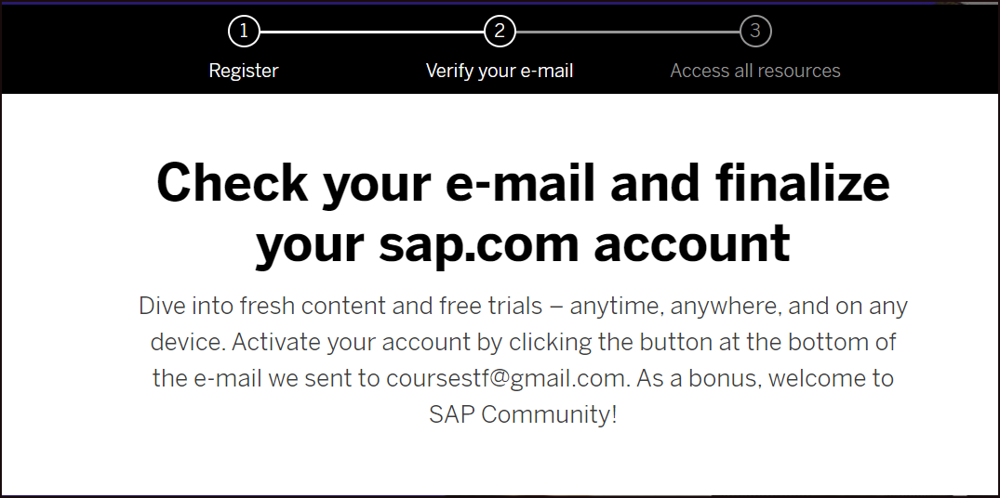
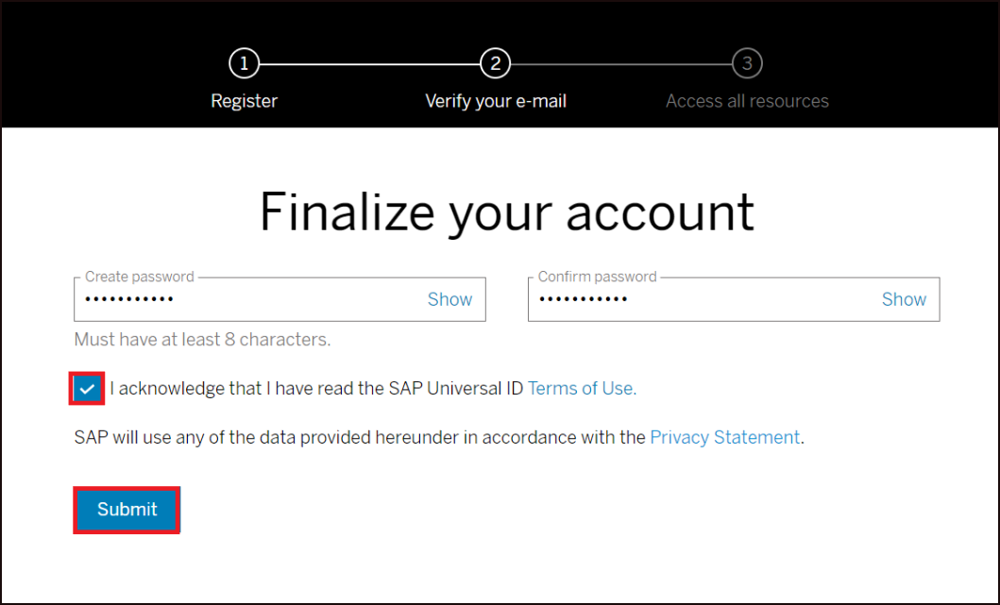
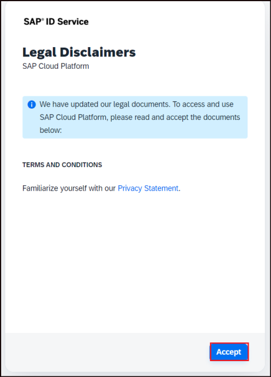
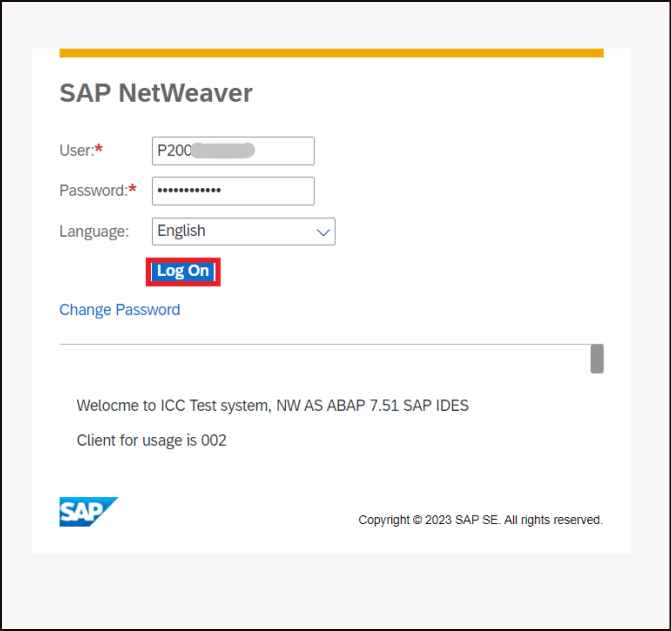
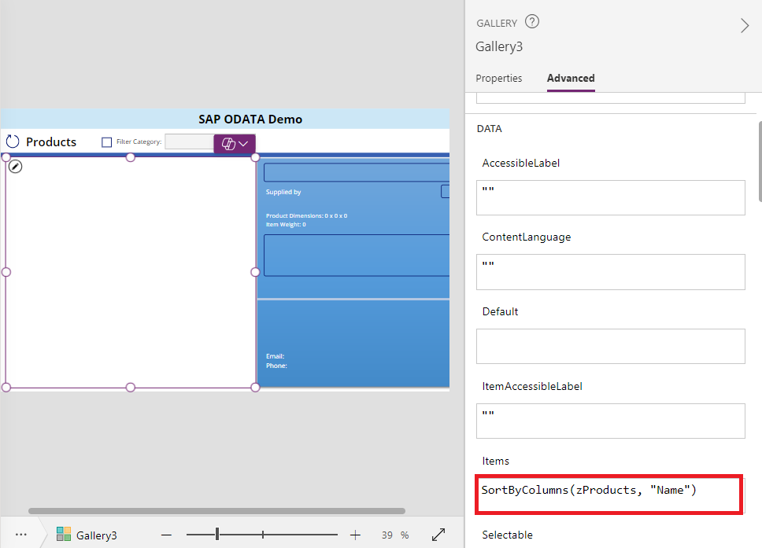

# Lab 1 - Streamlining SAP Product Updates with Power Apps and OData

## Objective 

Streamline product management and updates for Contoso Electronics by
integrating SAP with Power Apps, enabling users to access and update SAP
product data directly from a custom-built canvas app. This solution
automates the flow of product information and reduces manual data entry
by connecting to an SAP OData API and leveraging Power Automate for
seamless updates.

## Solution Focus Area: 

Contoso Electronics aims to simplify the way their product information,
such as pricing, is updated in their SAP system. Currently, updates are
made manually, leading to inefficiencies and potential errors in the
data. By integrating SAP and Power Platform, the company can create a
more efficient workflow, enabling users to access real-time product data
and make updates directly from a Power Apps canvas app.

**The key challenges addressed include:**

1.  **Manual Updates**: Product information updates in SAP are currently
    labour-intensive and prone to error, resulting in outdated or
    incorrect data.

2.  **Inefficiency in Data Access:** Users must navigate multiple
    systems to access and update product information, leading to delays
    in the process.

To address these challenges, Contoso Electronics will implement an
integrated solution using Power Apps, Power Automate, and a custom OData
connector to automate the retrieval and updating of product data in SAP.

### Estimated Time: 45 min

## Exercise 1: Create an SAP Account

### Task 1: Create an SAP Account

1.  Log into the SAP website at +++https://www.sap.com+++ and click on the
    admin button.
    Test data
    

3.  Click on **Create your SAP account.**

    

4.  Fill in your details, select the checkbox for accepting the terms
    and conditions and click on **Submit**.

    

5.  You will get the **Check your email and finalize your account**
    screen.

    

6.  Open the email from the sender **SAP Universal ID - Notification**
    in your registered mailbox and click on **Click to activate your
    account.**

    

7.  On the next screen, create and confirm the password, select the
    check box to acknowledge the SAP Universal ID Terms of Use and then
    click on **Submit**.

    

    > **Note:** Make a note of this username and password for future use to
access the SAP related pages.

8.  You will land on the **Thank You** page.

    

9.  Close the Thank You screen.

### Task 2: Create an account for Gateway Demo System

1.  Open <https://register.sapdevcenter.com/SUPSignForms/> from your
    browser. Enter your email id (the one that you provided during the
    SAP id creation) and click on **Continue**.

    

2.  Provide the SAP login password and then click on **Sign In**.

    

3.  Click on **Accept**.

    

4.  You will be taken to the SAP Gateway Demo Server page with the login
    details to the system.

5.  Select the check box to accept the Terms and conditions and then
    click on **Register**.

    

6.  Click on Show password to view the password.

    

7.  Check the mailbox and open the mail from <devcenter@sap.com>. Open
    the Login to the SAP Gateway WebGUI link from the email.

    

8.  Login using the login details from the email.

    

9.  Change the password and click on **Change**.

    

    > **Note:** Make a note of this **User id** and **Password**. This will be
the login credentials for your SAP Demo system.

10. Click on **Continue**.

    

11. You will get a successfully logged on screen.

     

12. Click on the **Fiori Launchpad** link. This is the Fiori Launchpad
    home page, which will be your gateway to the SAP Demo System.

    

## Exercise 2: Create a Custom Connector (OData connection)

### Task 1: Sign Up for Microsoft Power Apps 

 

1.  Open your web browser and go to the
    <https://powerapps.microsoft.com/free/> page. 

2.  On this page, locate the **Try free** button and click on it to
    begin the sign-up process. 

    

3.  Under the "Let's get started" section, you will see a text box
    labelled **Enter your Microsoft 365 admin credential or Work-School
    Email Id**.

4.  After entering your **ID**, check the agreement box to agree to the
    terms and conditions. 

5.  Click on **Start free** to proceed. 

    

6.  If you receive a prompt stating that you already have a Microsoft
    account associated with the entered email address, select **Sign
    in**. Enter your same **ID and Password** when prompted. 

7.  After signing in, you may be prompted with an option to stay signed
    in. Select **Yes** to stay signed in for quicker access in the
    future. 

    

8.  Once you are signed in, look at the top-right corner of the screen.
    Choose the environment **Dev One.** This is important for the next
    steps, as you will need to select this environment when working in
    Power Apps. 

    

### Task 2: Create Power Apps Custom OData Connector

1.  Select **Dev One** environment.

    

2.  From the left pane, click on the **More** and then select **Discover
    all**.

    

3.  Scroll down the Discover all connection and click on **Custom
    connectors** under **Data**.

    

4.  On the Custom connector page, click on **+ New custom connector**
    and then select the **Import from Github** option.

    

5.  Select the following details in the Import from Github pane.

    1.  Connector Type - Custom

    2.  Branch – dev

    3.  Connector – SAP-ODATA-Demo

    

6.  In the SAP-ODATA-Demo page, you can see the URL of the demo system
    as in the screenshot below.

    

7.  Select **2.** **Security** from the drop down and then select
    **Edit**

    

8.  Select **Basic authentication**.

    

    > **Note:** The username and password will be the login details of your gateway demo system which we will have to provide later.

9.  The next screen **(3. Definition),** shows the available Actions
    with the connector.

    

10. The URL shows the path to the ProductSet.

    

11. Click on **Create Connector**.

    

12. Once created, the **Create connector** option gets changed to
    **Update connector**.

    

## Exercise 3: Create the Canvas App and Power Automate Flow

### Task 1: Create Canvas Power App

1.  From the Power Apps home page, select **Apps** from the left pane
    and select **Import apps.**

    

2.  Download power apps with the help of GitHub link
    <https://github.com/microsoft/PowerPlatformConnectors/blob/master/custom-connectors/SAP-ODATA-Demo/SAP%20EPM%20Products%20Demo%20Starter.msapp>
    .

    

3.  In Import app click on the **From File (.msapp)**, browse app file
    and import the app.

    

4.  The imported app looks like the given below, the app has multiple errors since we have not connected to SAP through ODATA yet. 

    

5.  From the left pane, select **Data** then click on **+ Add data**.
    Search for OData and then select **SAP-ODATA-Demo** from it.

    

6.  Provide the login credentials of your Demo Gateway system. Click on
    **Got it** under the Premium dialog.

    

    

7.  Once the connection is made, all the errors except for one will
    have been resolved. Click on **Gallery3** from Tree view. Select
    **Advanced** tab from the **Gallery** Pane.

    

8.  Select the formula under **DATA -\> Items**. Replace the formula
    with the below one.

    > SortByColumns(zProducts, "Name")

    

9.  Save the app and click on the **Play** button.

    

10. Click on the **Refresh icon** of the Products on the app. Here, we can
    find the list of all the products from the demo SAP System, that we
    browsed through the Fiori launchpad.

    

11. Click on any item to view their values on the right-side pane. The
    app is now without any errors.

    

12. Click on **10” Portable DVD player** from the Products list. Do some
    update to the Price and click on the Tick mark. When clicked, we get
    an error message,

    > TODO: Fix the “OnSelect” formula to invoke a flow. This is because we have not defined UpdateButton yet.

    

13. From the top right corner close the app.

    

### Task 2: Add a Power Automate flow

1.  Select the **Power Automate** button from the left pane and then
    select **Create new flow**.

    

2.  On the Create your flow pane, select **+ Create from blank.**

    

3.  The flow pane gets opened click on **PowerApps(V2)**. Select **+ Add
    an input** \> **Text**.

    

4.  Enter the name as **ProductID**.

    

    Similarly, add the following as in the screenshot below.

    | **Property** | **Data Type** |
    |--------------|---------------|
    | Name         | Text          |
    | Description  | Text          |
    | E-Tag        | Text          |
    | Price        | Number        |

    

5.  Rename the flow as **UpdateProduct** and then click on **+ New
    step**.

    

6.  In the New step, select **Custom** under choose an operation and
    then select the **SAP-ODATA-Demo**.

    

7.  Enter the SAP ES5 Username and Password and click on **Create**.

    

8.  Select **Get product** from the SAP-OData-Demo.

    

9.  Under Get product, type **HT-2000** in the ID field and select
    **fetch** under x-csrf-token and then select **+ New step**.

    

10. In the New step, select **Customer \> SAP-O-DATA** and then select
    **Update product**.

    

11. Once added, select the **Product ID** field and select the **Product
    ID** that we added under the trigger, Power Apps(V2).

    

12. For the x-csrf-token, add **x-xsrf-token**.

    

13. For **x-ms-cookie-header,** click on the Expression tab and then
    paste the below content.

    > replace(outputs('Get_product')\['headers'\]\['Set-Cookie'\],',',';')

    

14. Select the values for the Properties as below.

    | **Property** | **Value**                   |
    |--------------|-----------------------------|
    | E-Tag        | PowerApps(V2) – E-Tag       |
    | Name         | PowerApps(V2) - Name        |
    | Description  | PowerApps(V2) - Description |
    | Price        | PowerApps(V2) - Price       |

    

15. From the top bar click on **Save** button.

    

16. Once saved, click on the **Close** button.

    

### Task 3: Invoke the flow

1.  Back in the Power Apps screen, you will see that the flow is now
    added to the app.

    

2.  Got to components click on the tick button and go to Advanced
    option, In Advanced option enter the below given formula in
    OnSelect.

    > UpdateProduct.Run(*ProductBox*.Product.ProductID,*ProductNameTB*.Text,*DescriptionTB*.Text,*ProductBox*.Product.\_\_metadata.etag,*PriceTB*.Text

    

3.  Click on **Save** and then click on the **Screens** tab under the
    **Tree view**.

     

## Exercise 4: Test and check the App and Flow

### Task 1: App Testing

1.  Click on **Play**.

    

    > Select the product, **10” Portable DVD player.** Change the Price on
the right-side pane of the app to **349.99** from 449.99. Click on the
**Tick Mark (UpdateButton)**. This action should trigger the
**UpdateProducts** Power Automate flow.

    

### Task 2: Check the flow and updates

1.  Go to the Power Automate page at <https://make.powerautomate.com/>

2.  Click on **My flows** and select **UpdateProducts**. Under the
    28-day run history, you can find the flow that you just triggered
    and find that the flow has succeeded.

    

3.  Open the link of the Fiori launchpad
    <https://sapes5.sapdevcenter.com/sap/bc/ui5_ui5/ui2/ushell/shells/abap/FioriLaunchpad.html#Shell-home>
    from the browser. Select the **Manage Products** tile.

    

4.  Click on **Go** and observe that the Price of the Product 10”
    Portable DVD player has been updated from 449.99 to 349.99.

    

### Conclusion

In this lab, participants learned how to integrate SAP with Microsoft Power Platform by creating an SAP account and accessing the SAP Gateway Demo System. They configured a custom OData connector to link SAP data with Power Apps, built a Canvas App to display and update product information, and created a Power Automate flow to automate product updates. The lab concluded with testing the app and flow, verifying updates in the SAP Fiori Launchpad, equipping participants with key skills for SAP-Power Platform integration.
