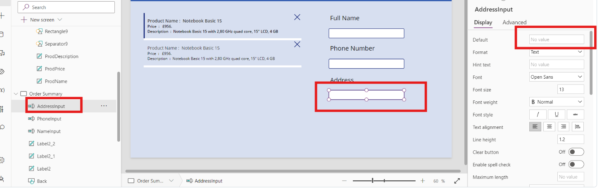

# Lab 2 - Optimizing Product Management and Orders at Contoso Electronics via Power App and SAP Integration

## Objective

Develop a Power App that integrates with an SAP system via the SAP OData connector to retrieve and display electronics product data. The app will enable customers to browse available products, view detailed information such as pricing and availability, and place orders seamlessly from the app. This solution aims to streamline the product discovery and ordering process, improving customer satisfaction and operational efficiency for Contoso Electronics.

### Solution Focus are

Contoso Electronics offers a broad range of electronic products, and while customers have access to an online store, the experience is often fragmented. Customers face challenges in accessing accurate, up-to-date product information and a seamless ordering process.

**The key challenges addressed include:**

- **Product Discovery:** Customers find it difficult to quickly browse and compare various products across different categories, slowing down purchasing decisions.
- **Ordering Process:** Customers often face delays or friction in placing orders, resulting in abandoned carts and poor conversion rates.

To address these challenges, Contoso Electronics will build a Power App connected to the SAP system using the SAP OData connector. This app will allow customers to:

- Browse real-time product data pulled directly from SAP, ensuring they have access to up-to-date prices, availability, and product descriptions.
- Easily add products to their cart and place orders directly through the app.
- Enjoy a smooth, user-friendly interface that simplifies the product discovery and ordering process, leading to a more efficient customer journey.

### Estimated Time : 45 mins

## Exercise 1: Login and Create OData Connection Power Apps

### Task 1: Sign In into Power Apps

1.  Navigate to the +++https://make.powerapps.com+++ and from the top right corner click on the **Sign in** button.

    

2.  Enter or select the admin tenant id and then click on the **Next** button.

    

3.  Enter the password in the respected field and then click on the **Sign** **in** button.

    

4.  **Check** the Don’t show this again box and click on the **Yes** to stay signed in.

    

5.  After Login From the top bar chose the developer **environment**. In our case **Dev One** is a development environment.

    

### Task 2: Create SAP OData Connection

1.  From the left Navigation bar select **More** and then click on the **Connections.**

    

2.  Then from the top bar click on the **+ New Connection.**

    

3.  Search SAP OData in the search bar from top right corner and then
    select +++**SAP OData**+++

    

4.  Enter the following details in the SAP OData configuration window and then click on **Create**.

    | Authentication Type | Basic |
    |----|----|
    | OData Base URL | +++https://sapes5.sapdevcenter.com/sap/opu/odata/iwbep/GWSAMPLE_BASIC+++ |
    | User Name | Enter SAP ES5 P-ID (we created in Lab 1) |
    | Password | Enter SAP ES5 P-Password (we created in Lab 1) |

    

5.  The New Connection is created now, click on the three dots (…) of
    the connection and select **Edit**. Rename the Display Name as
    +++**Contoso-Product**+++. Enter again the same P ID and Password and click on
    **Save**.

    

## Exercise 2: Create and Configure Contoso Power App

### Task 1: Create Contoso Power apps

1.  From the left-hand navigation bar click on the **+ Create** and then select **Start with a blank canvas**.

    

2.  Then click on **Responsive and start creating app**

    

3.	Welcome to Power Apps Studio window will open click on **Skip**.

    

4.	Click on the **New Screen** and select **Blank Screen**

    

5.	Click on the **Screen 1 (…)** and **Delete** the screen.

    

6. Click on the **Save** button from top and enter **Contoso Product App** as name of the app and select **Save**.

    

6.  Navigate to **Tree view**, click on three dots on **Screen 2** (…)
    and the select **Rename**. Enter the name as +++**Product List**+++

    

6.  In the left-hand navigation pane, go to **Components** under the
    **Tree View.** Click on **+ New Component**.

    

7.  Rename the component to +++**HeaderLabel**+++ by clicking on the “...” and
    selecting **Rename**.

    

    > **Note:** If the **Properties** window does not appear on the right
side, you can easily access it by clicking on the **Properties**
button located in the top bar. This action will open the
**Properties** window, allowing you to view and modify the relevant
settings.

    

8.  In the right-hand pane under **Properties**, set the **Width** to
    +++1400+++ and **Height** to +++100+++.

    

9.  On the Canvas, click **Add an item from the Insert Pane**. From the
    Insert Pane, select **Text Label**.

    

10. In the right-hand pane, under **Properties**, set the following:

    1.  **Text**: +++Contoso Products+++

    2.  **Font Size**: +++30+++

    3.  **Text Alignment**: Center

    4.  **Position**: X – 0, Y – 0

    5.  **Size** : **Width** +++1400+++, **Height** +++100+++

    6.  **Text Colour**: White

    7.  **Fill Colour**: blue

    

11. Then go to Tree view and select screen. Click on **Insert** from top
    bar. Search and select +++**HeaderLabel**+++ to use the new component on
    the screen.

    

12. Select **Product** **List** screen and go to **Properties**. Select
    **Fill** and choose colour.

    

13. Go to **Insert** from top bar and search and select +++**Text Input**+++.

    

14. Rename the **Text Input** as +++**SearchBar**+++ and Adjust the location
    and size of Text Input as show in Image.

    

15. Go to **SearchBar** input text and then go to **Properties** set the
    default value of search bar as +++**Notebook**+++ , With the help of this
    bar user can search product by **Category**.

    

### Task 2: Add SAP OData Connection in App

1.  Go to Data and select **Add data**.

    

2.  In the Search bar of Add data search for +++**SAP OData**+++  and then select
    **SAP OData**.

    

3.  After selecting connection, select **Contoso-Product SAP OData**
    Connection. Then Connection will be added into the app.

    

4.  Choose the table **ProductSet** from the right hand side Choose a
    table section and then select **Connect.**

    

5.  Then go to **Insert** and search and select +++**Vertical Gallery**+++.

    

6.  Select the **ProductSet** as the data source into the vertical
    gallery and adjust the gallery as shown in image.

    

### Task 3: Configure Product Gallery Screen

1.  Go to Tree view --> Screen, rename the Gallery1 name as +++**Product Gallery**+++ and adjust the
    gallery on the canvas as shown in image.

    

2.  Click on the **Product Gallery** and go to **Properties** of it,
    configure the layout as **Title, Subtitle, Body**.

    

3.  Go to Product Gallery, By clicking on (…) of each rename **Body** as
    +++**ProdDescription**+++, **Subtitle** as +++**ProdPrice**+++ and **Title** as
    +++**ProdName**+++

    

4.  Go to **properties** of Product Gallery and click on **7 Selected**,
    configure the selection as per given below:

    | ProdDescription | Description |
    |-----------------|-------------|
    | ProdName        | Name        |
    | ProdPrice       | Price       |

    

5.  Go to **Product Gallery** and click on **ProdName**, enter the given
    below formula in the **Text Formula Bar**.

    +++"Product Name :" & ThisItem.Name+++

    

6.  As same as **ProdName** change the formula of **ProdPrice** and
    **ProdDescription** as given below.

    | ProdPrice       | +++"Price  :   " & Text(Value(ThisItem.Price),"\$#,###.##")+++ |
    |-----------------|----------------------------------------------------------|
    | **ProdDescription** | +++**"Description : " & ThisItem.Description**+++                  |

    

    

7.  Select the **Product Gallery** and Click on **arrow** sign on in the
    gallery canvas. Press **delete** button to remove the arrow.

    

8.  Click on the **Product Gallery** and go to formula bar of the
    gallery enter the below given Item formula in the field.

    +++Filter(ProductSet,StartsWith(Category,SearchBar.Text))+++

    

9.  Select **Product gallery** then click on the **Pencil** icon on the
    gallery canvas. Then go **Insert** and search and select +++**Button**+++.

    

    

10. Place the button at appropriate position with the help of drag and
    drop. And in the button **Properties** **Text** field enter +++**Add to
    cart**+++.

    

11. Go to Product gallery click on (…) on the button and rename the
    button as +++**CartButton**+++.

    

12. Click on the **CartButton** button and go to formula bar, Select
    **Onselect** and add **formula** as given below.

    +++Collect(Collection,{Name:ThisItem.Name,Price:ThisItem.Price,Describe:ThisItem.Description})+++

    

13. Select **Product Gallery** and then go to **Insert** Seach and
    select a +++**Button**+++.

    

14. Rename the button as +++**Reload**+++. Place the Button at appropriate
    position and set the properties as given below

    | Text        | Reload |
    |-------------|--------|
    | Text Colour | Blue   |
    | Fill Colour | White  |

    

16. Click on **Reload** button and Select **OnSelect** and add the below
    given formula into the formula bar.

    +++Reset(*SearchBar*)+++

    

### Task 4: Create and Add the Power Apps Table

1.  Go to **Data** section, click on **+ Add Data** and then select
    **Create new tables**. Power Apps tables with open.

    

2.  Select **Start from blank** and start creating table.

    

3.  By clicking on the table name Rename the tables as +++**Cart**+++.

    

4.  Click on the down arrow sign of the first column and then select the
    Edit column option. Rename the Display name as +++**Product Name**+++.
    Then click on the update button.

    

5.  Select **+ New column** and enter the display name as +++**Product Price**+++, after entering the name click on **Save**.

    

6.  Select **+ New column** and enter the display name as +++**Customer Name**+++, After entering the name click on **Save**.

    

7.  Select **+ New column** and enter the display name as +++**Customer Address**+++, After entering the name click on **Save**.

    

8.  Select **+ New column** and enter the display name as +++**Customer Contact**+++, After entering the name click on **Save**.

    

9.  From top of the window and click on the **Save and exit**.
    Confirmation windows pop up **again click on Save and exit** to save
    the table. It will automatically redirect to Contoso app.

    

### Task 5: Create Order Summary Screen form Contoso Product App

1.  Go to **Tree** **view** 🡪 **Screens**. Click on **+ New Screen** and
    then select **Blank.**

    

2.  Go to **Screen 3**. Click on (…) three dots and select **Rename**.
    Rename the screen 2 as +++**Order Summary**+++.

    

3.  Select **Order Summary**, go to **Insert** then search and select
    +++**HeaderLabel**+++ .

    

4.  Select **Order Summary Screen**, go to **Insert** then search and select
    +++**Vertical Gallery**+++ .

    

5.  Go to **Gallery**, click on three dots next to gallery name. select
    **Rename** and rename the gallery as +++**OrderGallery**+++. Place the
    **OrderGalley** at appropriate position as shown in **image**. Go to
    the **formula bar** of the **OrderGallery** select **Items** and
    enter the below given **formula**.

    +++Collection+++

    

6.  Click on the **OrderGallery**, go to properties and change the
    Layout as **Title, subtitle, body.**

    

7.  Click on **Order Summary** Screen, got to properties. Change the
    **colour** **fill** same as the previous screen.

    

8.  Go to **Product List** screen and go to **Insert**. Search and
    select the +++**Button**+++.

    

9.  Go to **Button**, click on three dots and select **Rename**.
    **Rename** the button as +++**MyCart**+++.

    

10. Select **MyCart** button, place the button at appropriate place and
    then go to properties. Set the properties of the button as given
    below.

    | Text        | Go to Cart |
    |-------------|------------|
    | Text colour | Blue       |
    | Fill Colour | White      |

    

12. Click on the **MyCart** button and enter the below given formula in
    formula bar as **OnSelect**.

    +++Navigate(*'Order Summary'*)+++

    

13. Click on the **Order Summary**, Go to Insert, search and select
    +++**Button**+++ .

    

14. **Rename** the button as +++**Back**+++ and place it at appropriate place.
    Change the **properties** of button as given below.

    | Text        | Back  |
    |-------------|-------|
    | Text Colour | Blue  |
    | Fill Colour | White |
    | Text    | Back |

    

16. Select **Back** button and enter the below given formula as
    **OnSelect**.

    +++Navigate(*'Product List'*)+++

    

17. Click on **OrderGallery** and go to properties of the gallery. Click
    on the **7 selected** option and select the fields as given below.

    - Body2 : Describe
    - Subtitle4: Price
    - Title4: Name

    

18. Go to **OrderGallery,** select **Body2** and rename the body as
    +++**CartProDes**+++. Then Enter the given below **formula** in formula
    bar as Text.

    +++"Description  :  " & ThisItem.Describe+++

    

19. Repeat the process for **Subtitle4** of **OrderGallery**, rename as
    +++**CartProdPrice**+++ and enter the **formula** as given below.

    +++"Price  :   " & Text(Value(ThisItem.Price),"\$#,###.##")+++

    

20. Repeat the same process for **Title4**, rename as +++**CartProdName**+++
    and enter the **formula** as given below.

    +++"Product Name :  " & ThisItem.Name+++

    

21. Select **OrderGallery**, click on the **pencil** icon in the gallery
    canvas field, go to **Insert**. Search and select +++**Cancel**+++ Icon.

    

    

22. Select and place the **Cancel** Icon at appropriate place as shown
    in image. Enter the formula given below as **OnSelect**.

    +++Remove(Collection,ThisItem)+++

    

### Task 6: Add Customer Information section

1.  Click on **Order Summary**, Go to Insert. Search and Select +++**Text Label**+++.

    

2.  Repeat the previous step for two more times and place the **Text
    label** at the appropriate place as show in image.

    

3.  Double click on each label one by one and enter the text as +++Full Name+++, +++Phone Number+++, +++Address+++. The final output show as given below
    image. Readjust the label if required.

    

4.  Select **Order Summary**, go to Insert. Search and select for +++**Text Input**+++ .

    

5.  Rename the Input Text as +++**NameInput**+++ and Place the Input Text just
    below the **Full Name**. Go to **properties** of the **NameInput**
    and Remove **Text** (Text Input) from **Default**

    

6.  Repeat the process select the **Text Label** Rename as
    +++**PhoneInput**+++ and place at below the **Phone Number**. From
    properties remove **Default** text.

    

7.  Repeat the process select the **Text Label** Rename as
    +++**AddressInput**+++ and place at below the Address. From properties
    remove **Default** text.

    

8.  Select **Order Summary**, go to **Insert**. Search and Select a
    +++**Button**+++.

    

9.  Click on the button and then select (…) and rename it as +++**Submit**+++ .
    Place the **Submit** button just below the **AddressInput**. Go to
    **Properties** of the **Submit** button, In the **Text** enter
    +++**Submit**+++ as Text.

    

10. Select the submit button, enter the given below formula as OnSelect.

    +++Patch(Carts,Defaults(Carts),{'Product Name':*CartProdName*.Text,'Product Price':*CartProdPrice*.Text,'Customer Name':*NameInput*.Text,'Customer Contact':*PhoneInput*.Text,'Customer Address':*AddressInput*.Text})+++

    

11. Click on the **Save** button from the right side of the top bar to
    **Save** the app.

    

## Exercise 3: Test Contoso Product App

1.  From the top bar click on the **Play** button to start testing.

    

.  Search +++**Notebook**+++ in the search field and choose a notebook and
    click on the **Add to cart** button. After that click on **Go to
    Cart** Button.

    

3.  Enter the **Full Name Phone Number and Address** and then click on
    **submit**. The order is placed for the products.

    

5.  Go to Power apps Tables and check the order Entry.

    

### Conclusion

In this lab, participants learned how to create an SAP OData connection within Power Apps, design a custom app (Contoso Product App), and integrate it with SAP data. They practiced adding SAP OData data to the app, configuring a product gallery to display items, and building functionality to filter, search, and add items to a cart. Additionally, participants created an order summary screen, added customer information input fields, and implemented a submission process using Power Apps tables. Finally, they tested the app by searching and adding products to the cart, enhancing their skills in Power Apps and SAP integration.
