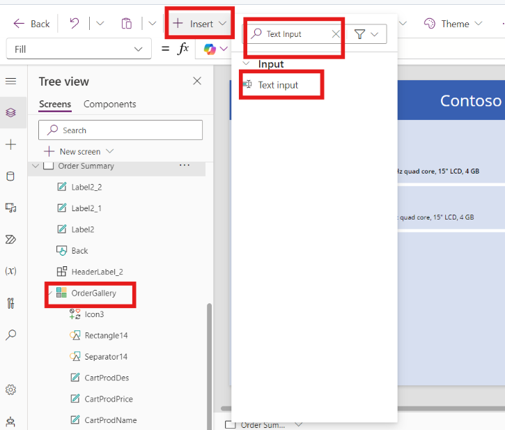

# Lab 2 - Optimizing Product Management and Orders at Contoso Electronics via Power App and SAP Integration

## Objective

Contoso Electronics, a leading retail company, is looking to streamline
its product management process to improve efficiency and enhance
customer experience. The company wants to create a Power App that
integrates with its SAP backend system to provide employees with easy
access to product information, manage inventory, and facilitate customer
orders.

### Solution Focus are

Contoso Electronics, a leading retail company, aims to enhance its
product management processes by developing a Power App integrated with
its SAP backend. This solution focuses on streamlining product
information management and order processing to improve operational
efficiency and customer experience.

1.  **Power Apps Development:** The initiative will leverage a
    user-friendly interface to enable employees to access and manage
    real-time product data from SAP using OData connectors. Features
    such as a dynamic product catalogue and detailed product insights will
    empower the sales team to quickly find necessary information and
    facilitate smoother order management.

2.  **Real-Time Data Integration and Reporting:** By ensuring real-time
    updates from the SAP system, the solution will enhance data accuracy
    and provide robust reporting capabilities. This will allow the sales
    and inventory management teams to track performance metrics, monitor
    stock levels, and make informed decisions, ultimately leading to
    faster order processing and improved customer satisfaction.

### Estimated Time : 45 mins

## Exercise 1: Login and Create OData Connection Power Apps

### Task 1: Sign In into Power Apps

1.  Navigate to the power apps page and from the top right corner click on the
    **Sign in** button.

    

2.  Enter the admin tenant id and then click on the **Next** button.

    

3.  Enter the password in the respected field and then click on the
    **Sign** **in** button.

    

4.  **Check** the Don’t show this again box and click on the **Yes** to
    stay signed in.

    

5.  After Login From the top bar chose the developer **environment**. In
    our case **Dev One** is a development environment.

    

### Task 2: Create SAP OData Connection

1.  From the left Navigation bar select **More** and then click on the
    **Connections.**

    

2.  Then from the top bar click on the **+ New Connection.**

    

3.  Search SAP OData in the search bar from top right corner and then
    select **SAP OData.**

    

4.  Enter the following details in the SAP OData configuration window.

    | Authentication Type | Basic |
    |----|----|
    | OData Base URL | <https://sapes5.sapdevcenter.com/sap/opu/odata/iwbep/GWSAMPLE_BASIC> |
    | User Name | Enter SAP ES5 P-ID (we created in Lab 1) |
    | Password | Enter SAP ES5 P-Password (we created in Lab 1) |

    

5.  The New Connection is created now, click on the three dots (…) of
    the connection and select **Edit**. Rename the Display Name as
    **Contoso-Product**. Enter again the same P ID and Password and click on
    **Save**.

    

## Exercise 2: Create and Configure Contoso Power App

### Task 1: Create Contoso Power apps

1.  From the left-hand navigation bar select on the **+ Create** and
    then select **Blank app.**

    

2.  Then create on **Create** button in the Blank canvas app and start
    creating Contoso power app.

    

3.  In the App name enter **Contoso Product App**, select **Tablet** as
    format and then click on **Create**.

    

4.  Welcome to Power Apps Studio window will open click on **Skip**.

    

5.  Navigate to **Tree view**, click on three dots on **Screen 1** (…)
    and the select **Rename**. Enter the name as **Product List.**

    

6.  In the left-hand navigation pane, go to **Components** under the
    **Tree View.** Click on **+ New Component**.

    

7.  Rename the component to **HeaderLabel** by clicking on the “…” and
    selecting **Rename**.

    

    > **Note:** If the **Properties** window does not appear on the right
side, you can easily access it by clicking on the **Properties**
button located in the top bar. This action will open the
**Properties** window, allowing you to view and modify the relevant
settings.

    

8.  In the right-hand pane under **Properties**, set the **Width** to
    1400 and **Height** to 100.

    

9.  On the Canvas, click **Add an item from the Insert Pane**. From the
    Insert Pane, select **Text Label**.

    

10. In the right-hand pane, under **Properties**, set the following:

    1.  **Text**: Contoso Products

    2.  **Font Size**: 30

    3.  **Text Alignment**: Center

    4.  **Position**: X – 0, Y – 0

    5.  **Width**: 1400, **Height**: 100

    6.  **Text Colour**: White

    7.  **Fill Colour**: blue

    

11. Then go to Tree view and select screen. Click on **Insert** from top
    bar. Search and select **HeaderLabel** to use the new component on
    the screen.

    

12. Select **Product** **List** screen and go to **Properties**. Select
    **Fill** and choose colour.

    

13. Go to **Insert** from top bar and search and select **Text Input**.

    

14. Rename the **Text Input** as **SearchBar** and Adjust the location
    and size of Text Input as show in Image.

    

15. Go to **SearchBar** input text and then go to **Properties** set the
    default value of search bar as **Notebook.** With the help of this
    bar user can search product by **Category**.

    

### Task 2: Add SAP OData Connection in App

1.  Go to Data and select Add data.

    

2.  In the Search bar of Add data search for SAP OData and then select
    OData Connection.

    

3.  After selecting connection, select Contoso-Product SAP OData
    Connection. Then Connection will be added into the app.

    

4.  Choose the table **ProductSet** from the right hand side Choose a
    table section and then select **Connect.**

    

5.  Then go to **Insert** and search and select **Vertical Gallery**.

    

6.  Select the **ProductSet** as the data source into the vertical
    gallery.

    

### Task 3: Configure Product Gallery Screen

1.  Rename the gallery name as **Product Gallery** and adjust the
    gallery as on the canvas as shown in image.

    

2.  Click on the **Product Gallery** and go to **Properties** of it,
    configure the layout as Title, Subtitle, Body.

    

3.  Go to Product Gallery, By clicking on (…) of each rename **Body** as
    **ProdDescription**, **Subtitle** as **ProdPrice** **and Title** as
    **ProdName.**

    

4.  Go to **properties** of Product Gallery and click on 7 Selected,
    configure the selection as per given below:

    | ProdDescription | Description |
    |-----------------|-------------|
    | ProdName        | Name        |
    | ProdPrice       | Price       |

    

5.  Go to **Product Gallery** and click on **ProdName**, enter the given
    below formula in the **Text Formula Bar**.

    >  "Product Name :" & ThisItem.Name

    

6.  As same as **ProdName** change the formula of **ProdPrice** and
    **ProdDescription** as given below.

    | ProdPrice       | "Price  :   " & Text(Value(ThisItem.Price),"\$#,###.##") |
    |-----------------|----------------------------------------------------------|
    | ProdDescription | "Description : " & ThisItem.Description                  |

    

    

7.  Select the **Product Gallery** and Click on **arrow** sign on in the
    gallery canvas. Press **delete** button to remove the arrow.

    

8.  Click on the **Product Gallery** and go to formula bar of the
    gallery enter the below given Item formula in the field.

    > Filter(ProductSet,StartsWith(Category,SearchBar.Text))

    

9.  Select **Product gallery** then click on the **Pencil** icon on the
    gallery canvas. Then go **Insert** and search and select **Button**.

    

    

10. Place the button at appropriate position with the help of drag and
    drop. And in the button **Properties** **Text** field enter **Add to
    cart**.

    

11. Go to Product gallery click on (…) on the button and rename the
    button as **CartButton**.

    

12. Click on the **Add to cart** button and go to formula bar, Select
    **Onselect** and add **formula** as given below.

    > Collect(Collection,{Name:ThisItem.Name,Price:ThisItem.Price,Describe:ThisItem.Description})

    

13. Select **Product Gallery** and then go to **Insert** Seach and
    select a **Button**.

    

14. Rename the button as **Reload**. Place the Button at appropriate
    position and set the properties as given below

    | Text        | Reload |
    |-------------|--------|
    | Text Colour | Blue   |
    | Fill Colour | White  |

    

15. Click on **Reload** button and Select **OnSelect** and add the below
    given formula into the formula bar.

    > Reset(*SearchBar*)

    

### Task 4: Create and Add the Power Apps Table

1.  Go to **Data** section, click on **+ Add Data** and then select
    **Create new tables**. Power Apps tables with open.

    

2.  Select **Start from blank** and start creating table.

    

3.  By clicking on the table name Rename the tables as **Cart**.

    

4.  Click on the down arrow sign of the first column and then select the
    Edit column option. Rename the Display name as **Product Name**.
    Then click on the update button.

    

5.  Select **+ New column** and enter the display name as **Product
    Price**, after entering the name click on **Save**.

    

6.  Select **+ New column** and enter the display name as **Customer
    Name**, After entering the name click on **Save**.

    

7.  Select **+ New column** and enter the display name as **Customer
    Address**, After entering the name click on **Save**.

    

8.  Select **+ New column** and enter the display name as **Customer
    Contact**, After entering the name click on **Save**.

    

9.  From top of the window and click on the **Save and exit**.
    Confirmation windows pop up **again click on Save and exit** to save
    the table. It will automatically redirect to Contoso app.

    

### Task 5: Create Order Summary Screen form Contoso Product App

1.  Go to **Tree** **view** 🡪 **Screens**. Click on **+ New Screen** and
    then select **Blank.**

    

2.  Go to **Screen 2**. Click on (…) three dots and select **Rename**.
    Rename the screen 2 as **Order Summary**.

    

3.  Select **Order Summary**, go to **Insert** then search and select
    **HeaderLabel.**

    

4.  Select **Order Screen**, go to **Insert** then search and select
    Vertical Gallery**.**

    

5.  Go to **Gallery**, click on three dots next to gallery name. select
    **Rename** and rename the gallery as **OrderGallery**. Place the
    **OrderGalley** at appropriate position as shown in **image**. Go to
    the **formula bar** of the **OrderGallery** select **Items** and
    enter the below given **formula**.

    > Collection

    

6.  Click on the **OrderGallery**, go to properties and change the
    Layout as **Title, subtitle, body.**

    

7.  Click **on Order Summary** Screen, got to properties. Change the
    **colour** **fill** same as the previous screen.

    

8.  Go to **Product List** screen and go to **Insert**. Search and
    select the **Button**.

    

9.  Go to **Button**, click on three dots and select **Rename**.
    **Rename** the button as **MyCart**.

    

10. Select **MyCart** button, place the button at appropriate place and
    then go to properties. Set the properties of the button as given
    below.

    | Text        | Go to Cart |
    |-------------|------------|
    | Text colour | Blue       |
    | Fill Colour | White      |

    

11. Click on the **MyCart** button and enter the below given formula in
    formula bar as **OnSelect**.

    > Navigate(*'Order Summary'*)

    

12. Click on the **Order Summary**, Go to Insert, search and select
    **Button**.

    

13. **Rename** the button as **Back** and place it at appropriate place.
    Change the **properties** of button as given below.

    | Text        | Back  |
    |-------------|-------|
    | Text Colour | Blue  |
    | Fill Colour | White |

    

14. Select **Back** button and enter the below given formula as
    **OnSelect**.

    > Navigate(*'Product List'*)

    

15. Click on **OrderGallery** and go to properties of the gallery. Click
    on the 7 selected option and select the fields as given below.

    

16. Go to **OrderGallery,** select Body and rename the body as
    **CartProDes**. Then Enter the given below **formula** in formula
    bar as Text.

    > "Description  :  " & ThisItem.Describe

    

17. Repeat the process for **Subtitle** of **OrderGallery**, rename as
    **CartProdPrice** and enter the **formula** as given below.

    > "Price  :   " & Text(Value(ThisItem.Price),"\$#,###.##")

    

18. Repeat the same process for **Title**, rename as **CartProdName**
    and enter the **formula** as given below.

    > "Product Name :  " & ThisItem.Name

    

19. Select **OrderGallery**, click on the **pencil** icon in the gallery
    canvas field, go to **Insert**. Search and select **Cancel** Icon.

    

    

20. Select and place the **Cancel** Icon at appropriate place as shown
    in image. Enter the formula given below as **OnSelect**.

    > Remove(Collection,ThisItem)

    

### Task 6: Add Customer Information section

1.  Click on **Order Summary**, Go to Insert. Search and Select **Text
    Label**.

    

2.  Repeat the previous step for two more times and place the **Text
    label** at the appropriate place as show in image.

    

3.  Double click on each label one by one and enter the text as **Full
    Name, Phone Number, Address**. The final output show as given below
    image. Readjust the label if required.

    

4.  Select **Order Summary**, go to Insert. Search and select for **Text
    Input.**

    

5.  Rename the Input Text as **NameInput** and Place the Input Text just
    below the **Full Name**. Go to **properties** of the **NameInput**
    and Remove **Text** (Text Input) from **Default**

    

6.  Repeat the process select the **Text Label** Rename as
    **PhoneInput** and place at below the **Phone Number**. From
    properties remove **Default** text.

    

7.  Repeat the process select the **Text Label** Rename as
    **AddressInput** and place at below the Address. From properties
    remove **Default** text.

    

8.  Select **Order Summary**, go to **Insert**. Search and Select a
    **Button**.

    

9.  Click on the button and then select (…) and rename it as **Submit.**
    Place the **Submit** button just below the **AddressInput**. Go to
    **Properties** of the **Submit** button, In the **Text** enter
    **Submit** as Text.

    

10. Select the submit button, enter the given below formula as OnSelect.

    > Patch(Carts,Defaults(Carts),{'Product Name':*CartProdName*.Text,'Product
Price':*CartProdPrice*.Text,'Customer Name':*NameInput*.Text,'Customer
Contact':*PhoneInput*.Text,'Customer Address':*AddressInput*.Text})

    

11. Click on the **Save** button from the right side of the top bar to
    **Save** the app.

    

## Exercise 3: Test Contoso Product App

1.  From the top bar click on the Play button to start testing.

    

2.  Search **Camcorder** In the search field, and then click on the
    **Add to cart** Button.

    

3.  Search **Notebook** in the search field and choose a notebook and
    click on the **Add to cart** button. After that click on **Go to
    Cart** Button.

    

4.  Enter the Full Name Phone Number and Address and then click on
    submit. The order is placed for the products.

    

5.  Go to Power apps Tables and check the order Entry.

    

### Conclusion

In this lab, participants learned how to create an SAP OData connection within Power Apps, design a custom app (Contoso Product App), and integrate it with SAP data. They practiced adding SAP OData data to the app, configuring a product gallery to display items, and building functionality to filter, search, and add items to a cart. Additionally, participants created an order summary screen, added customer information input fields, and implemented a submission process using Power Apps tables. Finally, they tested the app by searching and adding products to the cart, enhancing their skills in Power Apps and SAP integration.
