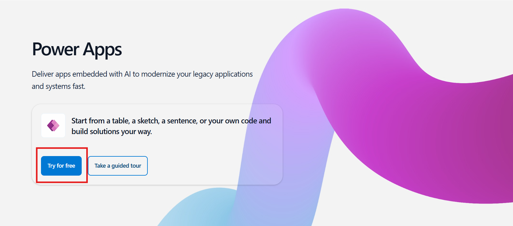
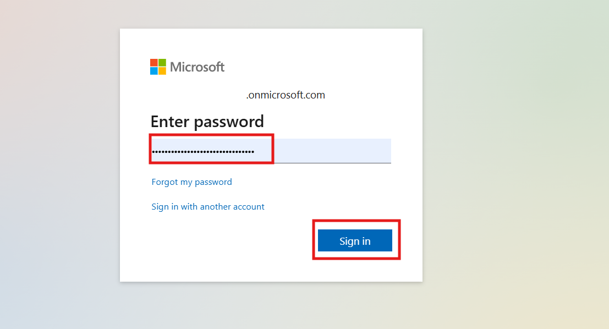
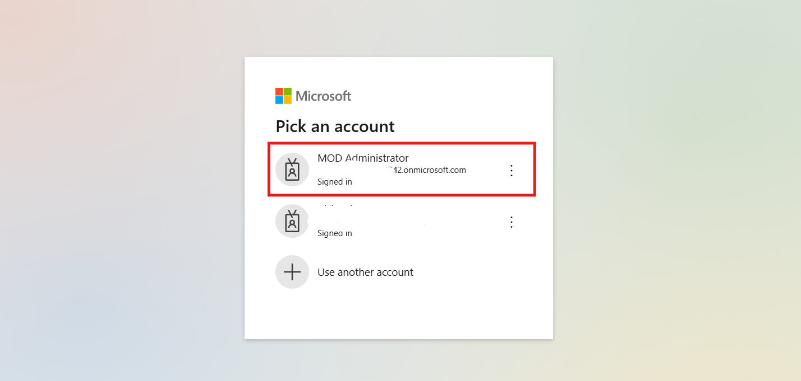
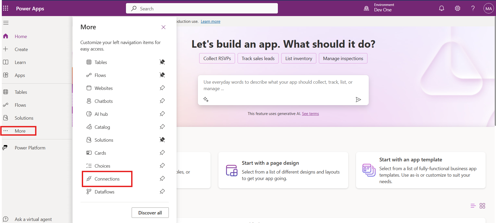
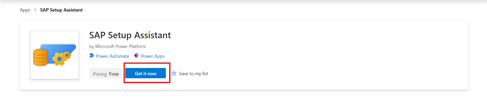
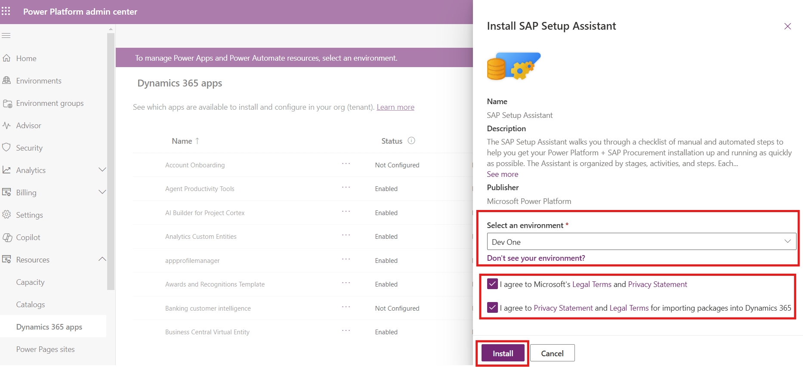
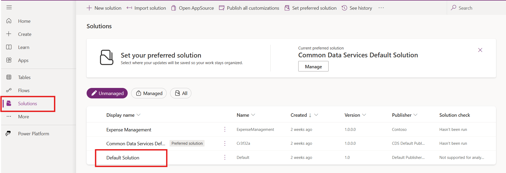
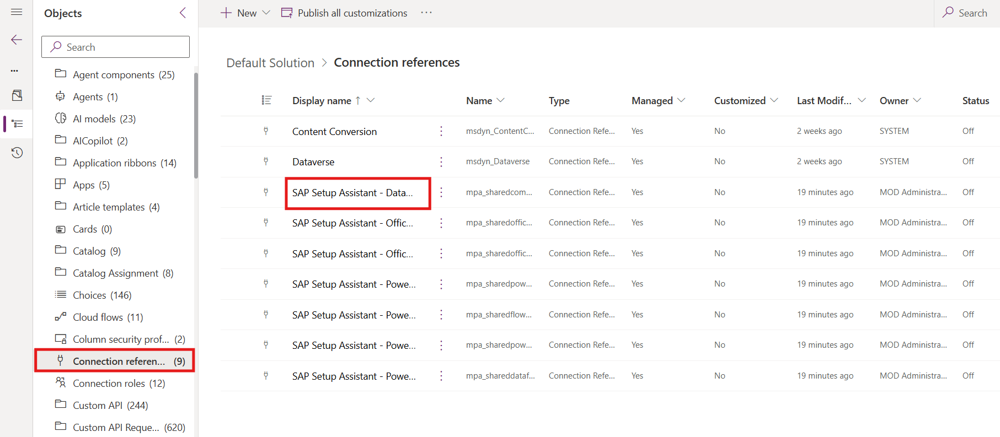
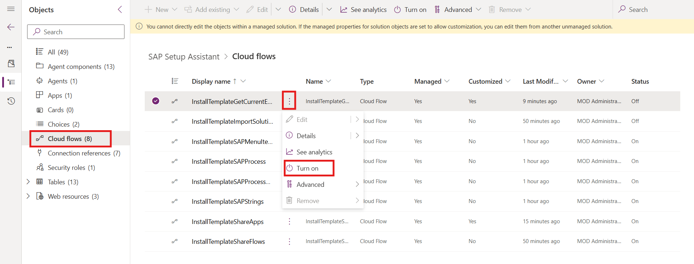

# Lab 3 Install and set up the SAP Setup Assistant

**Objective:** This lab is designed to guide participants through the
process of setting up and configuring the SAP Setup Assistant within the
Microsoft Power Platform environment. Participants will learn how to
establish necessary connections, install the SAP Setup Assistant, update
connection references, enable cloud flows, and access the SAP Setup
Assistant canvas app. This lab provides a hands-on approach to preparing
the Power Platform environment for integration with SAP, enabling
participants to connect to various services and configure essential
settings.

**Estimated Time:** 20 mins

# Task 1: Create Connection

1.  Navigate to
    <https://www.microsoft.com/en-in/power-platform/products/power-apps>
    and click on **Try for free.**
    

2.  Enter the Admin Tenant ID, select the check box and then click on
    the **Start free**.

    

3.  Enter the Admin Password and click on the **Sign in**.

    

4.  If pick an account window pop up, select **Admin account** to login
    into Power Apps.

    

5.  From the top bar in Power apps select the **Dev One** environment.

    

6.  From the left navigation bar click on **More** and select
    **Connections.**

    

7.  From the top bar click on the **+ New Connection.**

    

8.  In the top right search bar, search for **Microsoft Dataverse,** and
    then select Microsoft Dataverse.

    

9.  Click on the **Create**, to create the connection.

    

10. Then Pick an account window will pop up, select the admin tenant
    account to complete the connection.

    

11. Repeat the same process to create the below given connections.

    - Office 365 Outlook

    - Office 365 Users connector

    - Power Apps for Makers connector

    - Power Automate Management

    - Power Platform for Admins connector

    - Power Query Dataflows connector

    

# Task 2: Install SAP Setup Assistant from AppSource

1.  Navigate to
    <https://appsource.microsoft.com/en-us/product/dynamics-365/powerplatformtemplates.mpa_sapsetupassistant>
    and click on the **Get it now**.

    

2.  The Power platform admin center will open, select the **Dev One**
    Environment, select both the check box and click on **Install**.
    This process install **SAP Setup Assistance** in the Dev One
    Environment.

    

3.  After Installation go to environment 🡪 Dev One 🡪 Dynamic 365 Page
    and confirm the installation status.

    

# Task 3: Update Connection Reference

1.  Navigate to Power apps, From the left navigation bar select
    **Solutions** and open **Default Solution.**

    

2.  Select **Connection References** from the list of the Objects in the
    left pane and then select and open **SAP Setup Assistant –
    Dataverse**.

    

3.  In Edit SAP Setup Assistant – Dataverse tab, click on the
    **Connection** dropdown and the select **Admin Tenant Id**, in which
    we create the connection. After that click on the **Save** button
    and again click on **Save Changes**.

    

4.  Repeat the Same process for the below given connections:

    - SAP Setup Assistant - Office 365 Outlook

    - SAP Setup Assistant - Office 365 Users

    - SAP Setup Assistant - Power Apps for Makers

    - SAP Setup Assistant - Power Automate Management

    - SAP Setup Assistant - Power Platform for Admins

    - SAP Setup Assistant - Power Query Dataflows

# Task 4: Turn on Cloud Flow

1.  From the left navigation pane click on **Solution**, then click on
    **Manged** and select and open **SAP Setup Assistant**.

    

2.  From the left navigation pane, select **Cloud Flows**. Locate any
    flows showing an "Off" status and turn them **On**.

    

# Task 5: Use the SAP Setup Assistant

You are now ready to use the **SAP Setup Assistant** canvas app,
installed as part of the SAP Setup Assistant solution.

**Conclusion:**

By the end of this lab, participants will have gained practical skills
in creating and configuring essential connections within Power Platform.
They will learn how to install applications from Microsoft AppSource,
manage connection references, and activate cloud flows, which are
critical components for seamless SAP integration. Additionally,
participants will be able to navigate the Power Platform environment
confidently, applying this knowledge to streamline data connectivity and
enhance automation capabilities with SAP systems.
