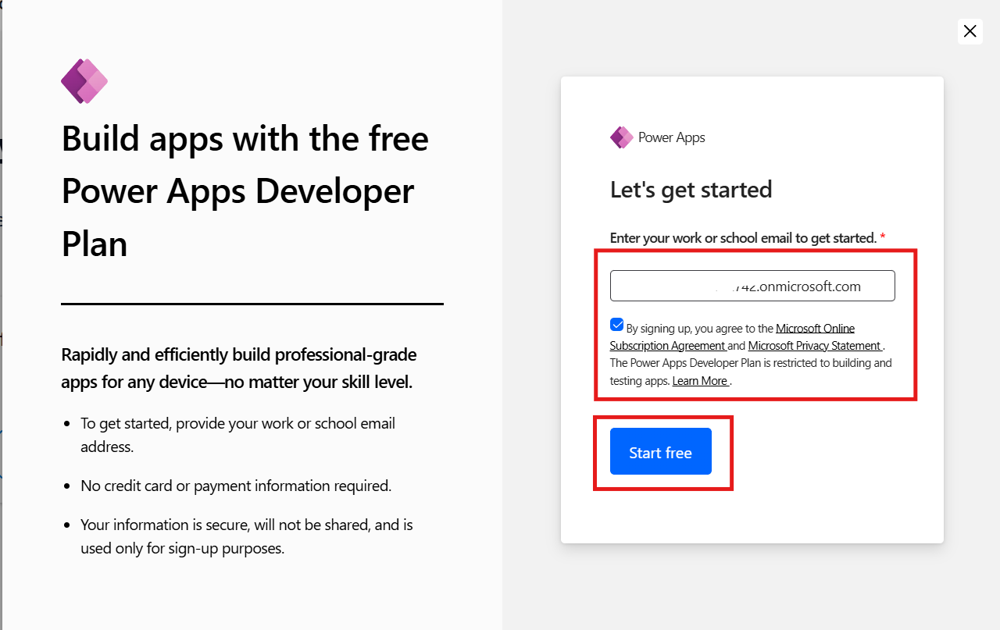
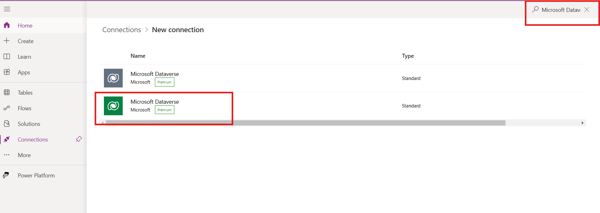
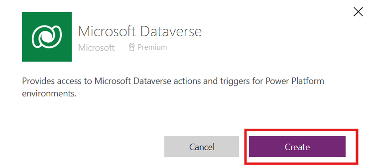
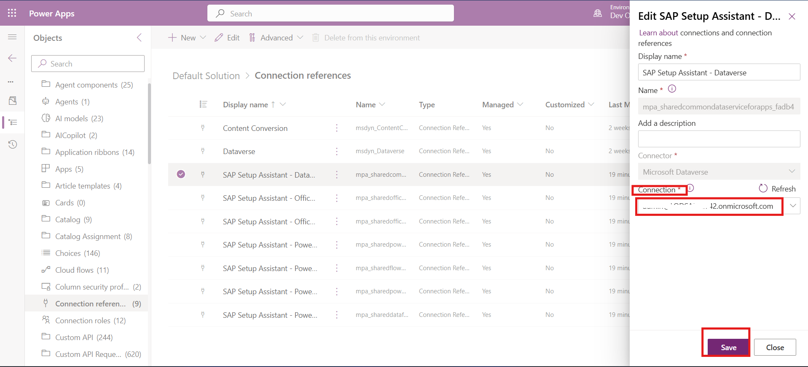
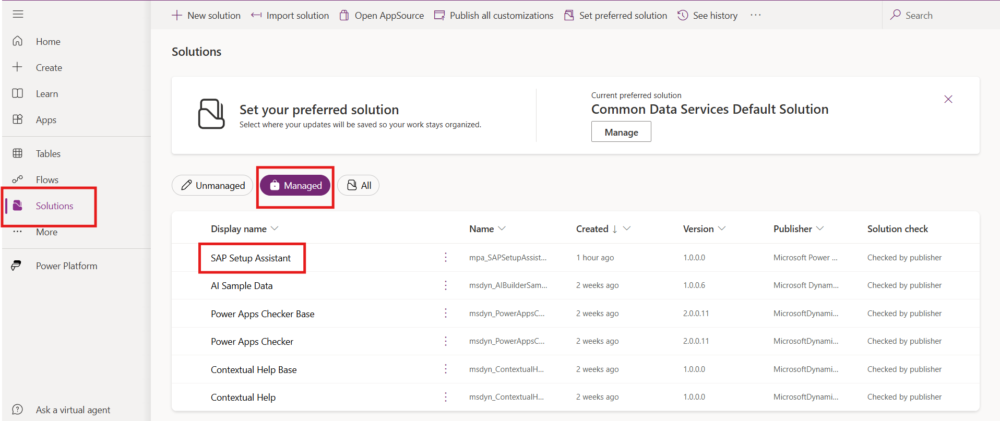
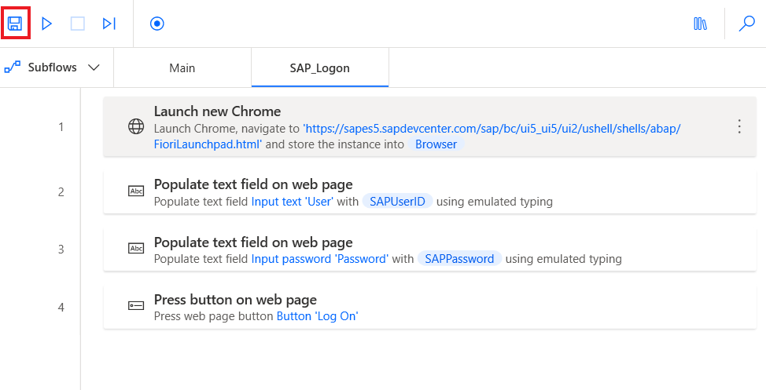
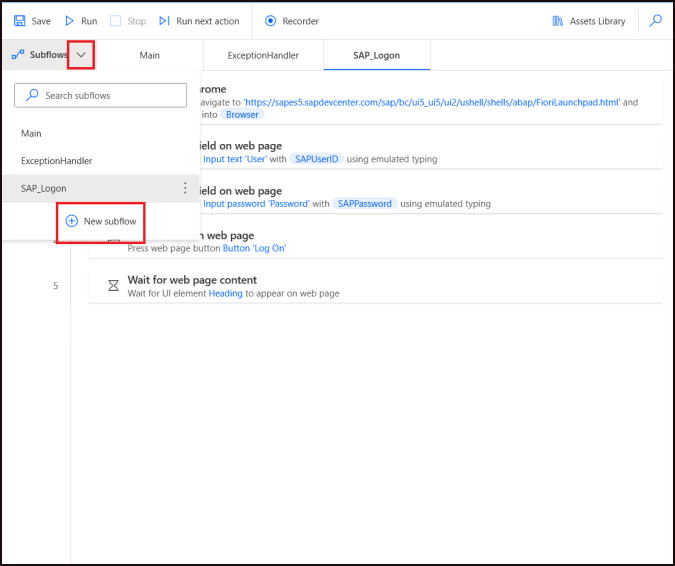
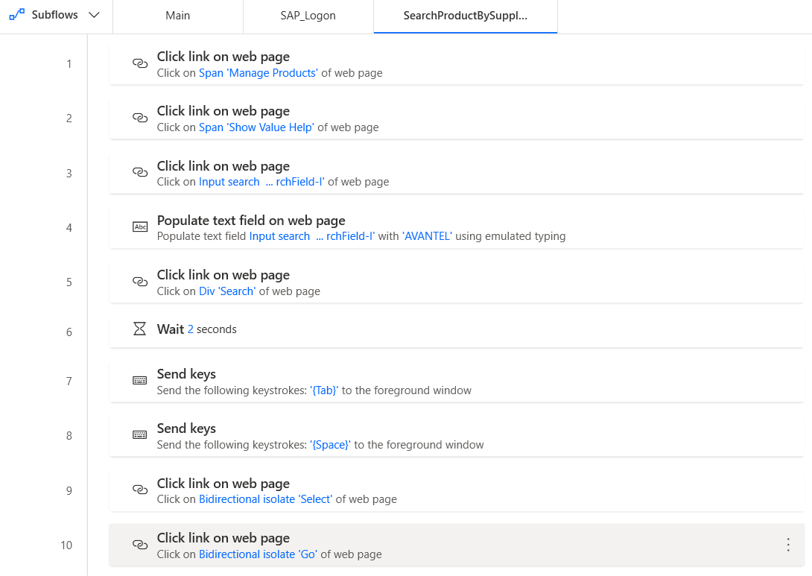

# Lab 3 - Boosting Operational Efficiency in Product Management with SAP Fiori Automation

## Objective 

To automate Contoso Electronics' product data management and reporting
processes using Power Automate Desktop (PAD). This will assist in
handling and processing large datasets related to product inventory,
performing automated searches, and generating detailed product reports
for internal use. The automation will streamline operational efficiency,
reduce manual effort, and ensure accuracy in data reporting.

## Solution Focus Area 

Contoso Electronics, a leader in consumer electronics, maintains a vast
inventory of products. The current manual product management process,
which involves searching for product information across various
databases and generating reports, has led to several challenges:

1.  **Time-Consuming Searches**: Employees manually search through
    product data, often spending hours filtering through large datasets
    to find relevant information.

2.  **Inefficient Report Generation**: Manually generating detailed
    reports from the gathered data leads to inconsistencies, delays, and
    potential errors.

To enhance internal operational efficiency, Contoso Electronics will
implement Power Automate Desktop to automate the product search and
report generation process. The automation will reduce manual effort,
increase accuracy, and improve overall productivity.

### Estimated Time: 60 min

## Exercise 1: Create a flow and declare the variables

### Task 1: Install Power Automate Desktop

1.  Sign in with your Admin tenant credentials to Power Automate
    using <https://make.powerautomate.com/>. Click **My flows** from
    left pane. Click **Desktop flows** then click **Install \>Power
    Automate for Desktop**.

    

2.  Navigate to **File Explorer** and click **Downloads** from left pane
    then double click **Setup.Microsoft.PowerAutomate.exe**.

    

3.  Click **Next** on **Install Power Automate package** pane.

    

4.  Click check box for **By selecting Install you agree to Microsoft’s
    terms of use**. Click **Install** on Installation details pane.

    

5.  Click **Yes** on Do you want to allow this app to make changes to
    your device? dialog.

    

6.  Click **Launch app** on Installation successful pane.

    

7.  Sign in with your Admin tenant credentials.

    

8.  You will be navigated to Power Automate for Desktop Home page.

### Task 2: Create a Power Automate Desktop flow.

1.  Open the Power Automate Desktop icon from the Desktop.

    

2.  From top bar select **Dev One** environment.

    

3.  To create a new flow, click on **+ New flow.**

    

4.  Name the flow as **SAP Fiori Automation.** Click on **Create**.

    

5.  The new flow gets created and opened.

    

### Task 3: Declare Input and Output variables

1.  From the right-side pane, select second icon to open **Variables**
    pane, click on the **+** icon under **Input/output variables** and
    select **Input**.

    

2.  On the New input variable pane, provide the following details and
    then click on **Save**.

    | **Property**      | **Value**                         |
    |-------------------|-----------------------------------|
    | Variable name     | SAPUserID                         |
    | Data type         | Text                              |
    | Default value     | **Enter Your SAP ES5 User ID which created in Lab 1**    |
    | External name     | SAP UserID                        |
    | Description       | SAP User ID to login to SAP Fiori |
    | Mark as Sensitive | Enable                            |

    

3.  Similarly, to add an input variable, click on **+sign** next to
    Input/output variables.

    

4.  Add an input variable for Password with the following details.

    | **Property**      | **Value**                      |
    |-------------------|--------------------------------|
    | Variable name     | SAPPassword                    |
    | Data type         | Text                           |
    | Default value     | **Your SAP ES5 Password which created in Lab 1**      |
    | External name     | SAP Password                   |
    | Description       | Password to login to SAP Fiori |
    | Mark as Sensitive | Enable                         |

    

5.  Now, we can see that there are two Input variables created and
    listed under the Variables pane on the right pane.

    

6.  Now, click on the **+ icon** to add an output variable.

    

7.  Fill in the details as below and click on **Save**.

    | **Variable**  | **Property**          |
    |---------------|-----------------------|
    | Variable name | Processingresults     |
    | Data type     | Text                  |
    | External name | Result                |
    | Description   | Result of the process |

    

## Exercise 2: Add a sub flow for Exception Handling 

1.  We will add Exception handling in order to handle scenarios like
    some window is not available or any UI click event failure and so
    on.

2.  Create a **Subflow** by clicking on **SubFlows** -\> **New
    subflow.**

    

3.  Name it as **ExceptionHandler** and then click on **Save**.

    

4.  In the search bar of the Actions pane, type **Get last error** and
    double click on the action **Get last error** to add it to the
    **ExceptionHandler** subflow and click on **Save**.

    

5.  In the search bar of the Actions pane, type **Set variable** and
    double click on the action **Set variable** to add the action to the
    flow. Add the values as per the below table and click on **Save**.

    | **Property** | **Value** |
    |----|----|
    | Variable | Click on NewVar, select the **x** symbol and select the output variable – **Processingresults** |
    | Value | **\## Exception \## - %LastError%** |

    

6.  Now, add an action **Stop flow,** which will stop the flow if there
    is an error.

    Fill in the details as below and click on **Save**.

    | **Property**  | **Value**                     |
    |---------------|-------------------------------|
    | End flow      | Select **With error message** |
    | Error message | **%LastError%**               |

    
    

7.  The **ExceptionHandler** subflow should now look as in the image
    below.

    

## Exercise 3: Add a subflow to logon to SAP Fiori 

### Task 1: Create Subflow and Actions to the Logon subflow

1.  Create a **Subflow** by clicking on **SubFlows** -\> **New
    subflow.**

    

2.  Name the subflow as **SAP_Logon**. Click on **Save**.

    

3.  From the search bar of the Actions pane, type in **launch**.

    

4.  Drag and drop the **Launch new Microsoft Edge**/**Launch new
    Chrome** action on to the SAP_Logon subflow screen.

    Under Select parameters, provide the following details and then click on
**Save**.

    | **Property** | **Value** |
    |----|----|
    | Launch mode | **Launch a new instance** |
    | Initial URL | <https://sapes5.sapdevcenter.com/sap/bc/ui5_ui5/ui2/ushell/shells/abap/FioriLaunchpad.html> |
    | Window state | **Normal** |

    

    > **Note:** You can use the browser of your choice from the list available
under the Browser automation actions in the Power Automate.

    

5.  Right click on the added action and select **Run from here**.

    

6.  This opens the **Fiori login page** in a new Chrome browser.

    > **Note:** To see this log in page, check that Fiori page is not already
open on your browser. If opened, log out from the page and again run the
action.

    

7.  From here, we can record the series of events to login to the
    system. Click on **Recorder** on the Power Automate flow screen.

    

8.  The Recorder gets opened. Have the **SAP Fiori login page** open and
    click on **Record** in Recorder pane.

    

9.  Select the **User ID** field and enter the SAP User ID into that,
    Then click on **Password field** and enter SAP Password. In last
    click on the **Log On** button

    > **Note:** While logging in, ensure that the text field or the button
that you are clicking on is highlighted, to ensure that your action is
being recorded by the recorder. (Like the Logon button is highlighted
in the screenshot below).

    

10. The sequence of events of logging into the system will get recorded
    by the recorder now.

11. After recording, click on pause button place at top and look for the
    recorded value in the recorder. Click on Arrow next to **Text** and
    select **Variable**.

    

12. Once Variable is selected, select **SAPUserID** from the variable
    names.

    

13. Then change the variable name for the Password as **SAPPassword**.

14. In the Recorder window, the recorded events should look similar to
    the events in the screenshot below. Click on **Done**.

    

15. The subflow **SAP_Logon** should look similar to the one in the
    screenshot below. Click on **Save** icon to save the flow.

    

    > **Note:** If there is an extra Launch new chrome action is added, right
click on it, and select Delete. There should be only one launch action.

16. Close the chrome browser and right click on the **Launch new
    chrome** action from the **Power Automate** **SAP_Logon** sub flow
    to check if the flow is working fine.

    

17. The flow would open a new Chrome browser, type in the **User** and
    **Password** details, click on the **Logon** button and opens up the
    **SAP Fiori**.

    

18. Back in the Power Automate Desktop flow, click on the UI Elements
    icon from the right pane and select **Add UI element**.

    

19. Open the chrome browser with the **SAP Fiori** open and capture the
    UI element **Purchase EPM**. To do this hover over the Purchase EPM
    Heading. Once you get it surrounded by the **Red box**, press **Ctrl
    button** and perform a **left click** at the same time.

    

20. This will add an entry in the UI element pane. Click on **Done**.

    

21. Back in the Power Automate screen, right click on the added UI
    element and select **Rename.** Rename it as **Heading**.

    

    

22. Add an action, **wait for web page content** as the last step in the
    **SAP_Logon** subflow. Select **Heading** under the UI element
    option and click on **Save**.

    

23. Click on **Save** icon to save the flow. Now, we have a flow which
    will open the SAP Fiori in a new Chrome browser, will logon to the
    system and wait till the page is loaded.

24. Close the browser that is opened while testing and then check the
    flow by performing a right click on the first action and select
    **Run from here**.

## Exercise 4: Add and configure subflow SearchProductBySupplier

### Task 1: Add Sub Workflow

1.  From the Power Automate flow page, click on the **Subflows** -\> **+
    New subflow**.

    

2.  Type in the name of the subflow as **SearchProductBySupplier** and
    click on **Save**.

    

### Task 2: Capture UI Elements for Search by supplier

1.  Click on the **UI element** and select **Add UI element**.

    

2.  Now, we will open the browser in which the **SAP Fiori** is open and
    capture the **UI elements** that will be used in this flow.

3.  To capture the UI elements, select **CTRL+left click** together.

4.  First, **capture** the **Manage Products (Ctrl+left click)** option
    in the SAP Fiori page. Once the element has been added to the UI
    element picker, click on the **Manage Products** option from the web
    page again (this time we are clicking on it to navigate to the next
    page and then capture the other elements from there).

    

    > **Note:** For each of the element, we will first capture the UI element
and then click on the same from the browser to get the flow of the
execution.

5.  **Capture** the **Supplier ID (Ctrl+left click)** option, Once the
    element has been added to the UI element picker, click on the
    **Supplier ID** option from the web page again.

    

6.  **Capture** the **Search box (Ctrl+left click)** option, Once the
    element has been added to the UI element picker, type in the
    **AVANTEL** in the Search bar.

    

7.  **Capture** the **Search icon (Ctrl+left click)** option, Once the
    element has been added to the UI element picker, click on the
    **Search Icon** option from the web page again.

    

8.  **Capture** the **Check Box (Ctrl+left click)** option, Once the
    element has been added to the UI element picker, click on the
    **Check box** option from the web page again.

    

9.  **Capture** the **Select (Ctrl+left click)** option, Once the
    element has been added to the UI element picker, click on the
    **Select** option from the web page again.

    

10. **Capture** the **Go (Ctrl+left click)** option, Once the element
    has been added to the UI element picker, click on the **Go** option
    from the web page again.

    

11. The UI element picker should now have all these UI elements added.
    It should now look like the one in the screenshot below. Click on
    **Done** on the UI element picker.

    

12. Then, right click on each of the element and **Rename** it for
    easier understanding. The elements will look like below after
    renaming.

    

### Task 3: Add actions to the flow

1.  Now, we will add the elements that were captured in the Task 1
    above, to the **SearchProductBySupplier** subflow.

2.  Add an action, **Click link on web page** and select **Manage
    Products** UI element. Leave the other defaults. Click on **Save**.

    

3.  Add an action, **Click link on web page** and select **Supplier ID**
    UI element. Click on **Save**.

    

4.  Add an action, **Click link on web page** and select **Search Box**
    UI element. Click on **Save**.

    

5.  Add an action, **Populate text field on web page** and again select
    **Search Box** UI element. Under Text, type the Value to be searched
    for. Here we have used **AVANTEL**. This can be changed as per your
    preference. Click on **Save**.

    

    > **Note:** Instead of hard coding this value, we can also add an input
variable and then use the variable name here.

6.  Add an action, **Click link on web page** and select **Search icon**
    UI element. Click on **Save**.

    

7.  Add a **Wait** Action. Enter the duration as **2,** to wait for 2
    seconds for the product to get loaded based on the Search text.
    Click on **Save**.

    

8.  Add an action, **Send Keys**. Select **Tab** key from Insert
    **Special Keys -\> Misc -\> Tab**. Click on **Save**.

    

9.  Add another **Send Keys** Action and select **Space** instead of
    Tab. Click on **Save**.

    

10. Add an action, **Click link on web page** and select **Select** UI
    element.

    

11. Add an action, **Click link on web page** and select **Go Button**
    UI element.

    

12. The flow should now look as in the screenshot below.

    

13. Add an action, **Extract data from web page**. Once added, with the
    Extract data from web page open in the Power Automate flow, **open**
    the browser in which we have the selected list of products on the
    **SAP Fiori**.

14. Right click on the column name (Image) and select **Extract entire
    HTML table**.

    

15. Once the table is added, click on **Finish** in the **Extraction
    preview** pane.

    

16. Back in the Power Automate, in the **Extract data from web page**
    pane select **Store data** mode as **Excel spreadsheet** and click
    on **Save**.

    

17. Click on **Save** icon to save the flow. Now, we have a sub flow
    which will search for a specific supplier name and export all the
    products of the supplier into an Excel.

## Exercise 5: Add subflow SAP_Logoff

### Task 1: Create Sub flow SAP_Logoff

1.  We will now create a new subflow named **SAP_Logoff** to log off
    from the **SAP Fiori**.

2.  Click on **Subflows -\> + New subflow.**

    

3.  In the **Add a subflow** pane, enter the name of the subflow as
    **SAP_Logoff.** Click on **Save**.

    

4.  The created subflow gets opened in a new tab.

5.  Open the UI Element pane and click on **Add UI element**.

    

6.  **Capture** the **UI elements** to perform the **Log off** action
    from the browser.

7.  First, capture the **P – Profile** button from the top right corner
    of the browser. To capture, press Ctrl+Left click on the item to be
    captured. Once captured, an entry will be made in the UI Element
    picker.

    

8.  Capture the **close** button of the browser in the **Goodbye**
    screen.

    

9.  Click on **Done** in the UI element picker.

    

### Task 2: Rename UI Elements

1.  Click on the added UI element one by one and change the name for
    each of them.

2.  Select the Profile Button **UI Element** that we captured and change
    its name to **Profile Button**.

    

3.  After renaming, the list of the log off actions UI elements should
    be like the list in the screenshot below.

    

### Task 3: Add Actions to the subflow

1.  From the **Actions** pane, drag and drop a **Click link on web
    page** action to the **SAP_Logoff** subflow pane. Select the UI
    Element to be the **Profile Button**. Click on **Save**.

    

2.  Next, add an action, **Send Keys**. Enter the given below text in
    **Text to send field** and then click on the **save** button

    > {Down}{Down}{Down}{Down}{Down}{Down}{Return}{Space}

    

3.  Add an action, **Close web browser** and click on **Save** with the
    web browser instance value as **Browser**.

    

4.  Now, the subflow should look like this.

    

## Exercise 6: Configure the Main flow

1.  The main flow does not have anything in it now.

2.  We will arrange the subflows that we created in order in the main
    flow to get a complete execution.

3.  First in the Main flow, from the Actions pane, drag and drop add an
    action **On block error** into the Main flow tab.

    

4.  Name the error block as **MainExceptionBlock**. Click on **+ New
    rule -\> Run subflow.**

    

5.  In the Run subflow option that gets added, select
    **ExceptionHandler**. Click on **Save**.

    

6.  The Main flow will now look like this.

    

7.  Next, add an action **Runsubflow.** Select SAP_Logon subflow from
    the drop down and click on **Save**.

    

    

8.  Similarly, add the 2 more actions of **Run subflow** and select
    **SearchProductBySupplier** and **SAP_Logoff** in the same order.

9.  Your main flow should now look like this.

    

10. Click on **Save**.

    

## Exercise 7: Test the Flow

1.  From the Main block, right click and select **Run from here**.

    

2.  Observe the flow that does the following.

    1.  Opens the SAP Fiori URL in a new Chrome browser.

    2.  Logs into the system providing the username and password.

    3.  Clicks on the Manage Products page.

    4.  Searches for a specific Supplier and gets the list of products
        of the supplier.

    5.  Exports the data to an excel sheet.

    6.  Logs off from the system.

    7. Closes the browser.

### Conclusion

In this lab, participants have successfully learned how to automate SAP Fiori tasks using Power Automate Desktop. They explored key concepts such as installing the Power Automate Desktop environment, creating flows, and managing variables. Additionally, they developed error handling with subflows, automated the SAP Fiori login process, and captured web UI elements to automate actions like searching for products by supplier. This exercise enhances participants' automation skills and introduces them to streamlining SAP Fiori processes efficiently through Power Automate Desktop flows.
