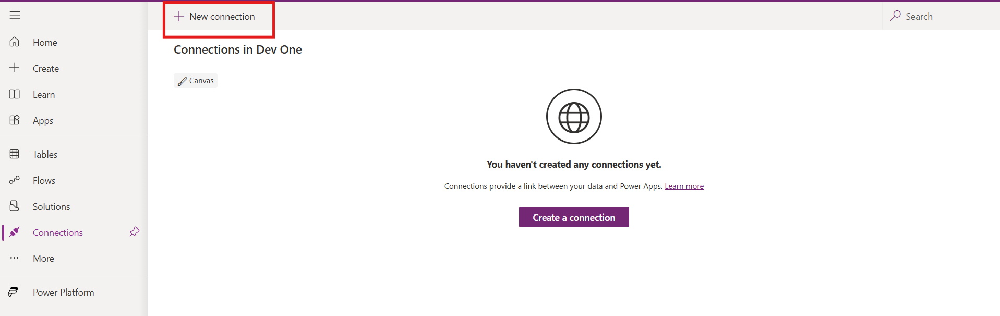
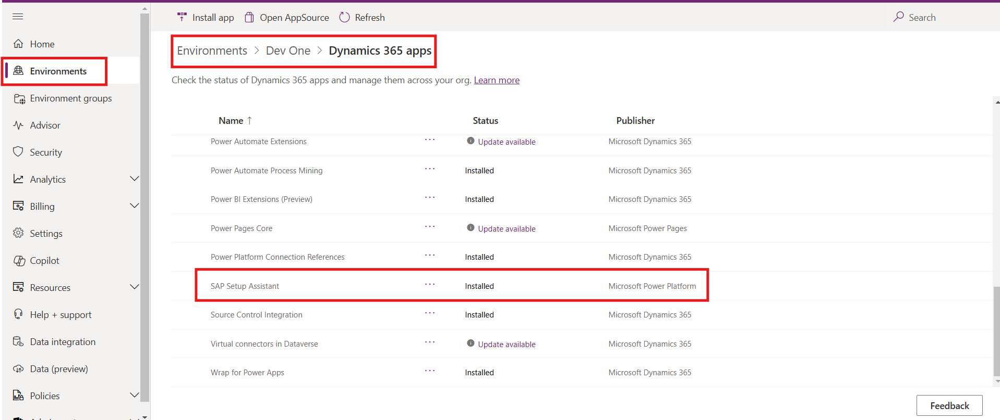

# Lab 3 Install and set up the SAP Setup Assistant

## Objective

The objective of this lab is to guide participants through the process of setting up critical connections within the Power Platform environment to ensure seamless SAP integration. Participants will configure connections, install the SAP Setup Assistant, manage connection references, activate cloud flows, and utilize the SAP Setup Assistant app to enable efficient SAP integration and automation for Contoso Electronics.

## Solution Focus Area

Contoso Electronics faces challenges in efficiently managing integrations and automating workflows between Power Platform and SAP systems. The company’s internal processes rely on real-time data synchronization, connection management, and the automation of repetitive tasks, but the current systems often lead to inefficiencies and manual errors.

#### Key challenges include:

- Connection Configuration: Manually setting up each individual connection to SAP and other platforms is time-consuming and error-prone.
- Automation of Workflows: Many internal processes that involve SAP data lack automation, leading to increased manual intervention.
- System Integration: Ensuring that all the required systems (SAP, Office 365, Power Automate) work together seamlessly, improving data flow and operational efficiency.

**To address these challenges, Contoso Electronics will:**

- Set up and configure essential connections, including Microsoft Dataverse, SAP, Office 365, and Power Automate connectors.
- Install the SAP Setup Assistant from Microsoft AppSource to simplify the integration process.
- Activate cloud flows to automate processes, eliminating the need for manual intervention and improving workflow efficiency.
- This solution will help Contoso Electronics streamline its operations by improving connectivity, automating tasks, and ensuring real-time SAP data access.

## Persona

**David Headsoon – Power Platform Administrator**

- Role: David is responsible for setting up and managing connections within the Power Platform environment. He ensures that all integrations, including SAP and Office 365, are properly configured and functioning.
- Tasks: David will create and configure various connections, including Microsoft Dataverse, Power Automate, and SAP. He will install the SAP Setup Assistant, update connection references, and turn on cloud flows to ensure smooth integration.

**Paula Mathew – Business Analyst / App Maker**

- Role: Paula is a business analyst who will be utilizing the configured connections and activated cloud flows to build applications and automate business workflows.
- Tasks: Paula will use the SAP Setup Assistant app to streamline data access and automate processes. She will rely on the configured connections to build apps that leverage SAP data for business operations, improving internal efficiency and decision-making.

**John Miller – Project Lead**

- Role: John oversees the entire integration project, ensuring that all configurations meet the business requirements and the system functions as expected.
- Tasks: John defines the project scope, ensures that the system meets business needs, coordinates with Ravi and Asha, and confirms the successful activation of all cloud flows. He will also verify that the SAP Setup Assistant app is fully operational and the integrations are working as intended.

**Estimated Time:** 20 mins

## Task 1: Create Connection

1.  Navigate to
    +++https://www.microsoft.com/en-in/power-platform/products/power-apps+++
    and sign in with Admin tenant ID. From the top bar in Power apps select the **Dev One** environment.

    

2.  From the left navigation bar click on **More** and select
    **Connections.**

    

3.  From the top bar click on the **+ New Connection.**

    

4.  In the top right search bar, search for +++**Microsoft Dataverse**+++ and
    then select **Microsoft Dataverse**.

    

5.  Click on the **Create**, to create the connection.

    

6. Then Pick an account window will pop up, select the admin tenant
    account to complete the connection.

    

7. Repeat the same process to create the below given connections.

    - +++**Office 365 Outlook**+++

    - +++**Office 365 Users**+++

    - +++**Power Apps for Makers**+++

    - +++**Power Automate Management**+++

    - +++**Power Platform for Admins**+++

    - +++**Power Query Dataflows**+++

    

## Task 2: Install SAP Setup Assistant from AppSource

1.  Navigate to
    +++https://appsource.microsoft.com/en-us/product/dynamics-365/powerplatformtemplates.mpa_sapsetupassistant+++
    and click on the **Get it now**.

    

2.  The Power platform admin center will open, select the **Dev One**
    Environment, select both the check box and click on **Install**.
    This process install **SAP Setup Assistance** in the Dev One
    Environment.

    

3.  After Installation go to environment 🡪 Dev One 🡪 Dynamic 365 apps page
    and confirm the installation status **SAP Setup Assistance**.

    

## Task 3: Update Connection Reference

1.  Navigate to Power apps, From the left navigation bar select
    **Solutions** and open **Default Solution.**

    

2.  Select **Connection References** from the list of the Objects in the
    left pane and then select and open **SAP Setup Assistant –
    Dataverse**.

    

3.  In Edit SAP Setup Assistant – Dataverse tab, click on the
    **Connection** dropdown and the select **Admin Tenant Id**, in which
    we create the connection. After that click on the **Save** button
    and again click on **Save Changes**.

    

4.  Repeat the Same process for the below given connections:

    - **SAP Setup Assistant - Office 365 Outlook**

    - **SAP Setup Assistant - Office 365 Users**

    - **SAP Setup Assistant - Power Apps for Makers**

    - **SAP Setup Assistant - Power Automate Management**

    - **SAP Setup Assistant - Power Platform for Admins**

    - **SAP Setup Assistant - Power Query Dataflows**

## Task 5: Use the SAP Setup Assistant

You are now ready to use the **SAP Setup Assistant** canvas app,
installed as part of the SAP Setup Assistant solution.

**Conclusion:**

By the end of this lab, participants will have gained practical skills
in creating and configuring essential connections within Power Platform.
They will learn how to install applications from Microsoft AppSource,
manage connection references, and activate cloud flows, which are
critical components for seamless SAP integration. Additionally,
participants will be able to navigate the Power Platform environment
confidently, applying this knowledge to streamline data connectivity and
enhance automation capabilities with SAP systems.
