# Lab 4 - Automating Product Info and Pricing Updates in SAP Using Microsoft Copilot Studio


## Objective 

Develop a lab use case for Contoso Electronics to streamline product
information retrieval and price updates in SAP using Microsoft Copilot
Studio integrated with Power Automate. The solution should help
Contoso's operations team to efficiently query product data, update
prices, and test these updates in SAP, enabling faster decision-making
and operational improvements.

## Solution Focus Area 

Contoso Electronics is continuously updating its product catalogue and
prices based on market trends and promotions. However, the manual
process of querying product information and updating prices in SAP
systems is time-consuming and prone to human error. The goal is to
automate the process by integrating Microsoft Copilot Studio with SAP
via Power Automate, allowing Contoso's team to retrieve product data and
update prices quickly and accurately.

**Key Challenges:**

- **Product Information Retrieval:** Contoso's operations team often
  requires real-time product information to make data-driven decisions.
  However, querying product information from SAP involves manual steps,
  leading to delays.

- **Price Updates:** Keeping product prices up to date in SAP based on
  promotions or market changes is critical but is currently slow and
  inefficient, affecting pricing accuracy.

To address these challenges, Contoso will use Microsoft Copilot Studio
integrated with Power Automate to automate SAP queries and updates,
ensuring accuracy and efficiency in operations.

### Estimated Time : 45 min
<br>

## Exercise 1: Create and Configure Copilot

### Task 1: Login in Copilot studio

1.  Navigate to
    <https://www.microsoft.com/en-us/microsoft-copilot/microsoft-copilot-studio>
    and click on **Sign in** button.

    

2.  Enter the login **admin tenant login ID** and click
    on the Next.

    

3.  Enter the **Admin tenant Password** and click on the **Sign In**
    button.

    

4.  Select **yes** for stayed sign in with credential.

    

### Task 2: Create a Copilot with Gen AI Capabilities

1.  Open Copilot studio and from top environment sections select **Dev
    One** environment.

    

2.  Click on the **Create** button form the left navigation bar and then
    select **New Copilot** option.

    

3.  Click on the **Skip to configure** and start manual configuration of
    copilot.

    

4.  Enter the following details in the respected fields and click on the
    **Create** button.

    1.  **Name:** SAP Product Copilot

    2.  **Description:** The Copilot allows you to integrate SAP system
        and fetch product information live from SAP and update price of
        products.

    3.  **Instructions:** The copilot must check the available product
        in SAP system and provide the product information as per the
        requirement and update the price of the product.

    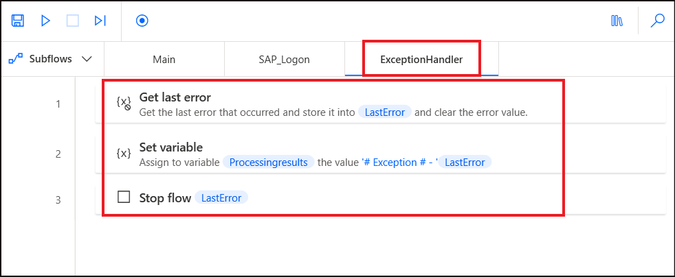

5.  Click on the **Setting** form the top right corner and then select
    **Generative AI** option. In Generative AI setting select
    **Generative AI (Preview)** and select **Medium** content
    moderation. After the configuration click on the save button.

    

## Exercise 2: Create Power Automate Flow for SAP Integration

### Task 1: Create Power Automate Flow for Product Information

1.  Then go back to overview section of copilot and select **Actions**
    from the top bar. After click on actions select **Add an action**
    button to create a new SAP action.

    

2.  Scroll down select **Choose an action section** and click on
    **Create a new flow** button, it will redirect to power automate
    flow.

    

3.  From top left corner rename the flow as **SAP Product Category**.

    

4.  Click on the **Run a flow from copilot** and select **+ Add an
    input**.

    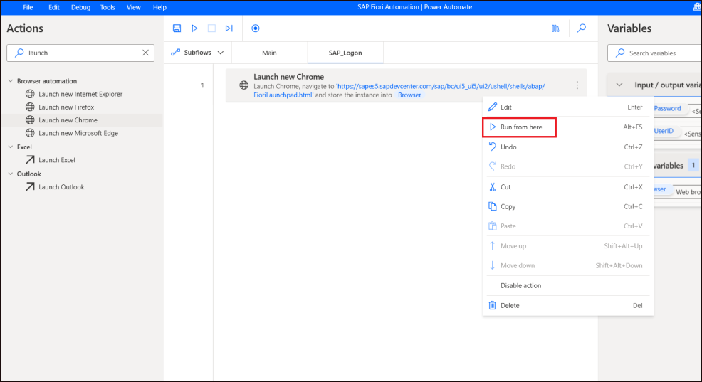

5.  In **+ Add an input** option select **Text** as type of input.

    

6.  Enter **Product Input** in the input section.

    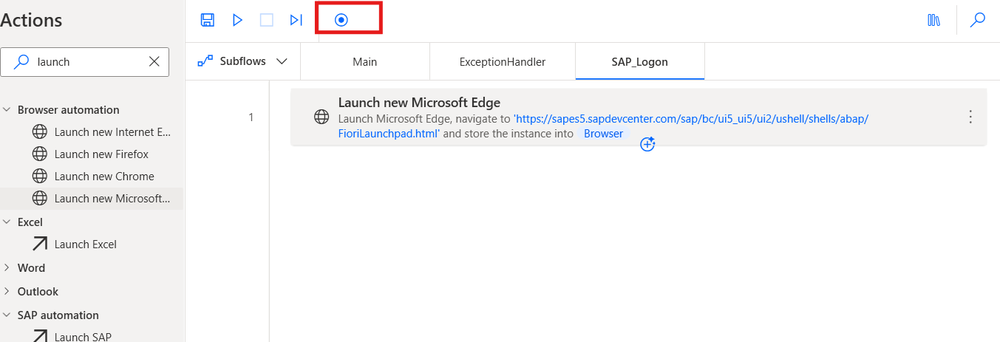

7.  Click on the **+** sign and select **Add an action** option.

    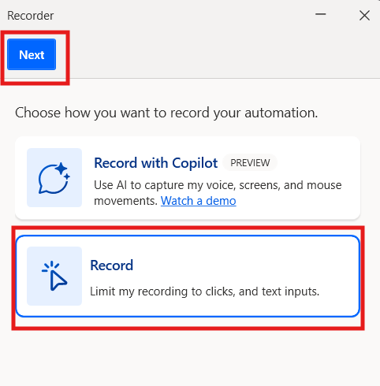

8.  In Add an action section enter **SAP OData** and select **Query
    OData entities.**

    

9.  Enter the following Details in the Create a new connection section
    and then click on the **Create new button**.

    1.  **Connection Name:** SAP-Product-100

    2.  **Authentication Type:** Basic

    3.  **OData Base URL:**
        <https://sapes5.sapdevcenter.com/sap/opu/odata/iwbep/GWSAMPLE_BASIC>

    4.  **User Name:** Enter the ES5 SAP User ID which we created in Lab 1.

    5.  **Password:** Enter the ES5 SAP Password which we created in Lab 1.

    

10. In **OData Entity Name** select **Productset** and then click on
    **Show all.**

    

11. In **\$Top** section enter **10,** which will return top 10 product.

    

12. Click on the **Respond to Copilot** option and click on **Add an
    output** option.

    

13. Select **Text** as type of output.

    

14. Enter **Product Output** as output name and then enter the
    **string(body('Query_OData_entities'))** as the value of the output
    with the help of function. click on the Add button after entering the
    output query.

    

15. **Save** and **Publish** the copilot.

    

16. Go back to copilot studio and click on the **Refresh**.

    

### Task 2: Create Power Automate Flow for Update Product

1.  On the **Choose an action** window scroll down and click on the
    **Create a new flow.**

    

2.  Rename the Flow Name as **Update Product Price.**

    

3.  Click on the **Run a flow from copilot** and then select **+ Add an
    input.**

    

4.  Select the type of user input as **Text**.

    

5.  Rename the input name as **Product ID.**

    

6.  Then again click on the + Add an input, select **Number** as input
    type and rename the input as **Update Price.**

    

7.  Click on the **+** Icon and select **Add an action.**

    

8.  Enter **SAP OData** in the Add an action search bar and click on
    **see more**.

    

9.  Click on the **Update OData entity**. After click on the entity, it
    will connect automatically with SAP OData Connection which we create
    in **SAP Product Category** flow.

    

10. Click on the OData Entity Name and select **ProductSet.**

    

11. In the ProductID sections select **ProductID** with the help of
    dynamic content.

    

12. Click on the **Advanced parameters** and select **Price**.

    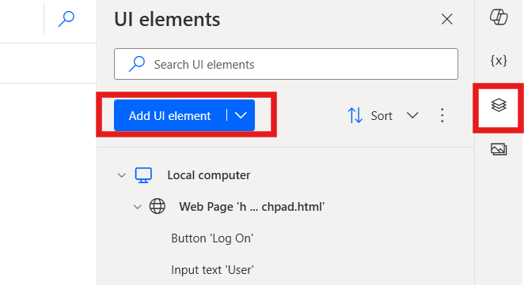

13. In the price parameter enter **Update Price** with the help of
    dynamic content.

    

14. Click on the **Save and draft** and then click on **Publish**.

    

## Exercise 3: Integrate Power Automate Flow with Copilot

### Task 1: Integrate SAP Product Category Flow

1.  Go back to copilot studio window and click on the **Refresh**
    button.

    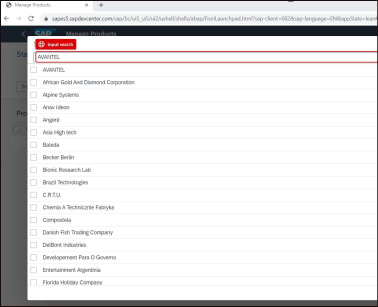

2.  Scroll down choose an action window and select **SAP Product
    Category** flow.

    

3.  Click on the next button.

    

4.  In the Input Parameter click on the edit input button and add the
    description as given below and the click on save button.

    > **Description:** Product Category. One of the following categories can
be used. The name has to be exactly like this: Accessories, Notebooks,
Laser Printers, Mice, Keyboards, Mousepads, Scanners, Speakers,
Headsets, Software, PCs, Smartphones, Tablets, Servers, Projectors, MP3
Players, Camcorders.

    

    

5.  Click on the outputs and then select edit outputs.

    

6.  Enter the given below given description and click on the save
    button.

    > **Description:** List of SAP products for a provided product category.
Return the result as table including following information: ProductID,
Category, Name, Description and Price.

    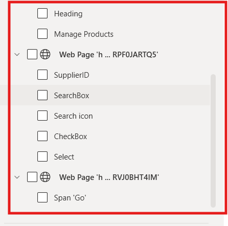

7.  Click on the **Next** button and after that click on the **Finish**
    to complete the configuration.

    

    

8.  Go to the action section and then select the SAP Product Category action.

    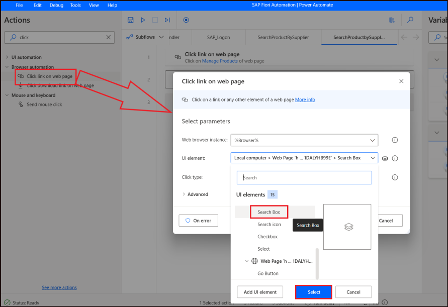

9.  Go to **Output** section and check the box **Respond to the user
    after running this action**. After checking the box click on the save
    button.

    

10. Click on the Test Button place as the top right side and enter the
    prompt Notebooks in the respected field. It will return the connect
    request. Click on the connect to give permission. After select
    connect, it will redirect to connection window.

    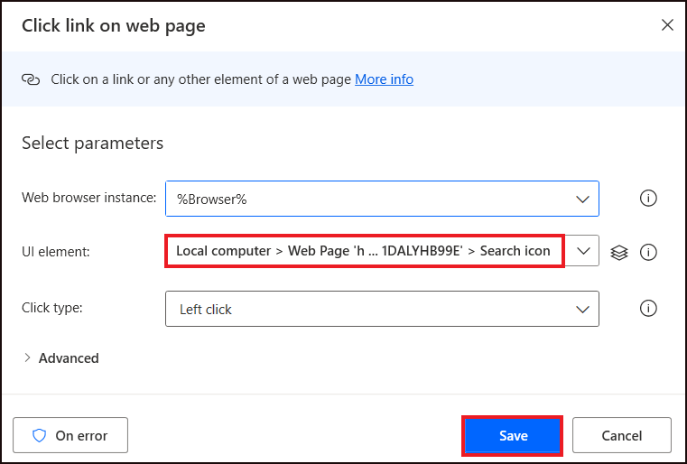

11. In the Manage your connections window click on the connect button.

    

12. Click on the three dots on SAP OData and select **SAP-Product-100**
    connection. After selecting the connection click on the Submit
    button.

    

13. Flow is shown as connected in the Manage connections.

    

### Task 2: Create topic Product Update

1.  Go to topic for the top bar and click on the **Add new topic** and
    then click on **From** **blank**.

    

2.  Rename the topic as **Product Update**.

    

3.  In the trigger node, Enter the below given description.

    > Update Product, Update Product Price, Update Price, Price Update

    

4.  Below trigger node, add **Message Node.**

    

5.  Enter the message in the Message Node which is given below.

    > Thank you for using our service. Please enter **Product ID** and
**Update Price** in below given card.

    

6.  Click on the + Sign below message node and add Ask with adaptive
    card node.

    

7.  Click on the three dots on adaptive card and click on the
    properties.

    

8.  Enter the below give code in the properties window and close the
    properties.

    ```
    {

    "type": "AdaptiveCard",

    "\$schema": "http://adaptivecards.io/schemas/adaptive-card.json",

    "version": "1.3",

    "body": \[

    {

    "type": "Input.Text",

    "placeholder": "Placeholder text",

    "id": "1",

    "label": "Product ID"

    },

    {

    "type": "Input.Number",

    "placeholder": "Placeholder text",

    "id": "2",

    "label": "Updated Price"

    },

    {

    "type": "ActionSet",

    "actions": \[

    {

    "type": "Action.Submit",

    "title": "Submit"

    }

    \]

    }

    \]

    }

    ```

    

9.  Below adaptive card output section is available, in output **section
    1** variable click on select a variable and then click on the create
    new, a new variable **Var1** is created.

    

10. Repeat the same process for the next output Var2 is created.

    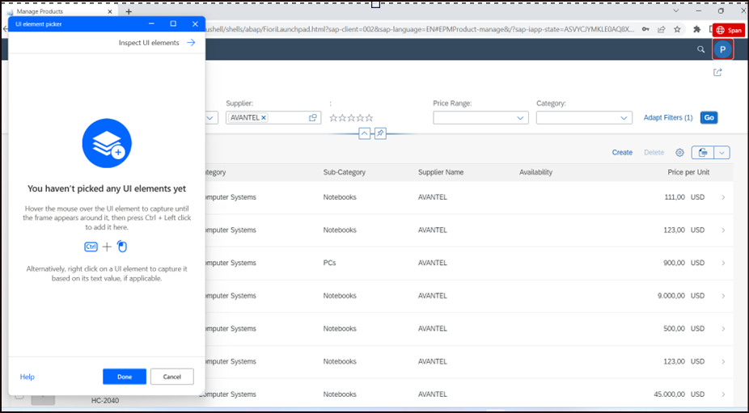

11. Go to variable from the top and select all right-side check box for
    all variables.

    

12. Below adaptive card, click on + sign and select call an action, then
    select **Update Product** flow.

    

13. In the Action select Var1 for Product ID and Var2 for Update Price.

    

    

14. Below Action node, click on + sign and add Message node, in message
    node enter the flowing message. **Product Var1 price is updated.
    Thankyou.** Replace Var1 with Variable name Var1 with the help of
    {x} button.

    

15. Click on the Test button and enter the prompt Update Price. Then
    fill in the Product ID (HT-1001) and price (1540), click on submit.
    After clicking on submit a message show to connect. Click on the
    connect.

    

16. It will navigate to another window which manages the connections. Click
    on the connect button of Update Product Price.

    

17. Click on the three dots and select connection SAP-Product-100 then
    click on submit button.

    

18. After completing it shows connected.

    

19. Click on the publish button to save the copilot setting

    

## Exercise 4: Integrate Copilot with SAP

1.  Go to Channels from the top bar which is placed next to Analytics
    and then click on **Microsoft Teams**.

    

2.  Then click on the **Turn on Teams** button.

    

3.  Now teams are connected successfully, now click on the **Open
    Copilot** a new window will open.

    

4.  On the new window click on the Use the web app instead.

    

5.  Now Teams app web app will open, click on the **Add** button to add
    the copilot. And then the chat bot is ready.

    

## Exercise : Test Copilot in teams.

1.  Open teams app and enter the prompt **Give me information about
    Notebooks.**

    > **Note:** If prompted Additional permissions are required to run this
action. To proceed, please select 'Connect', and review any missing
connections. Click on connect and apply the same steps as we perform
before. After connection created back to teams and then type prompt
again.

    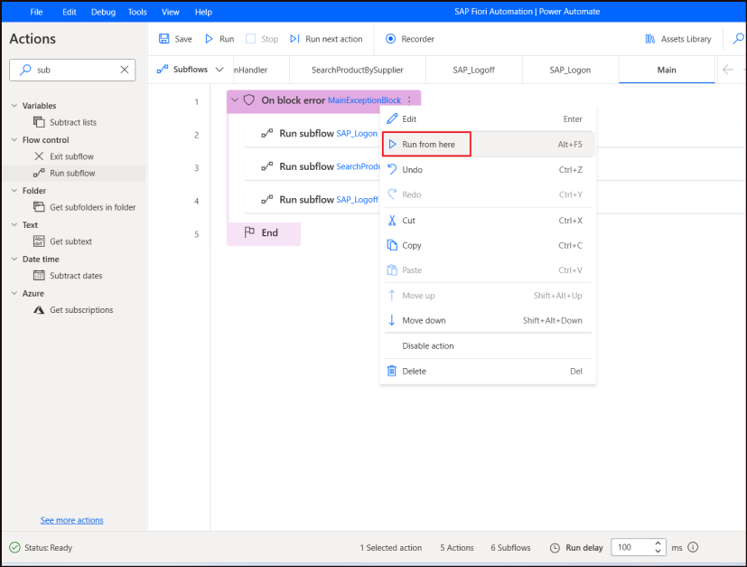

2.  It returns the information of the Notebooks from SAP System.

    

3.  Then give another prompt, I want to update price of product.

    

4.  Now it returns the adaptive card, enter Product ID HT-1001 and in
    price enter 1111 and then click on the submit.

    

    > **Note:** If prompted Additional permissions are required to run this
action. To proceed, please select 'Connect', and review any missing
connections. Click on connect and apply the same steps as we perform
before. After connection created back to teams and then type prompt
again.

5.  After entering the Product ID and Price confirmation message
    appears.

    

6.  To confirm the updation, go to <https://sapes5.sapdevcenter.com/> ,
    click on Fiori Launch, login with your User Id and Password, Click
    on manage product. Then in search bar type HT-1001 and then click
    go.

    

7.  Now see the updated price of the product is 1111.

    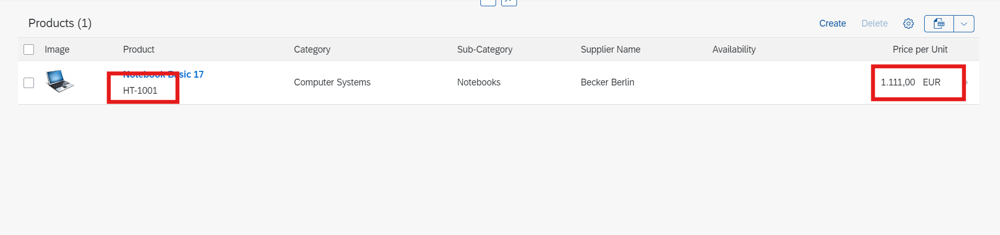

### Conclusion

In this lab, participants learned how to create an SAP account and set up a Gateway Demo System for accessing SAP. They were guided through configuring Microsoft Copilot Studio with generative AI capabilities to integrate SAP and automate product information retrieval and updates. Using Power Automate, participants created flows to fetch and update product data in SAP. The lab concluded with integrating Copilot into Microsoft Teams, providing an interactive way to manage SAP data. The exercises highlighted key skills in connecting SAP with Microsoft technologies for streamlined business processes.
