# Lab 4 - Boosting Operational Efficiency in Product Management with SAP Fiori Automation

## Objective 

To automate Contoso Electronics' product data management and reporting
processes using Power Automate Desktop (PAD). This will assist in
handling and processing large datasets related to product inventory,
performing automated searches, and generating detailed product reports
for internal use. The automation will streamline operational efficiency,
reduce manual effort, and ensure accuracy in data reporting.

## Solution Focus Area 

Contoso Electronics, a leader in consumer electronics, maintains a vast
inventory of products. The current manual product management process,
which involves searching for product information across various
databases and generating reports, has led to several challenges:

1.  **Time-Consuming Searches**: Employees manually search through
    product data, often spending hours filtering through large datasets
    to find relevant information.

2.  **Inefficient Report Generation**: Manually generating detailed
    reports from the gathered data leads to inconsistencies, delays, and
    potential errors.

To enhance internal operational efficiency, Contoso Electronics will
implement Power Automate Desktop to automate the product search and
report generation process. The automation will reduce manual effort,
increase accuracy, and improve overall productivity.

### Estimated Time: 60 min

# Exercise 1: Create a flow and declare the variables

## Task 1: Install Power Automate Desktop

1.  Sign in with your Admin tenant credentials to Power Automate using
    +++<https://make.powerautomate.com/+++>. Click **My flows** from the
    left pane and then click **Desktop flows**.

    

2.  Click on **Start a free trial** on the desktop flow page.

    

3.  Select **Install** Button from top right corner and then select
    **Power automate for desktop**.  

    

4.  Navigate to File Explorer and click **Downloads** from left pane
    then double click **Setup.Microsoft.PowerAutomate.exe**.  

    

5.  Click **Next** on Install Power Automate package pane.

    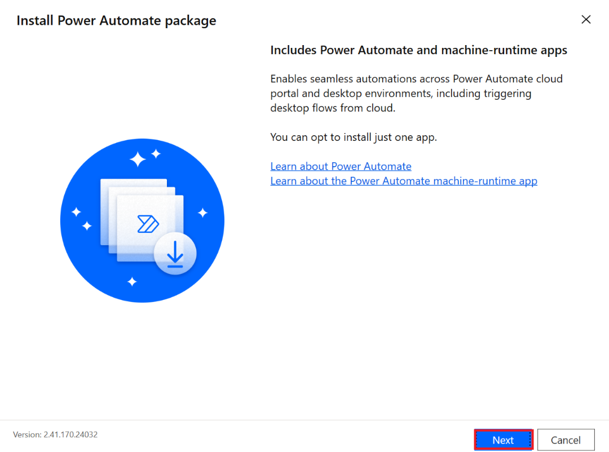

6.  Click check box for **By selecting Install you agree to Microsoft’s
    terms of use**. Then select **Install** on Installation details
    pane.

    

7.  Click **Yes** on Do you want to allow this app to make changes to
    your device? dialog.

    

8.  After successfully installation **close** the window.

    

## Task 2: Create a Power Automate Desktop flow.

1.  Open the Power Automate Desktop icon from the Desktop.

    

2.  **Sign in** with your Admin tenant credentials. You will be
    navigated to Power Automate for Desktop Home page.

    

3.  From top bar select **Dev One** environment.

    

4.  To create a new flow, click on **+ New flow**.

    

5.  Name the flow as +++SAP Fiori Automation+++ and then click on
    **Create**.

    

6.  The new flow gets created and opened.

    

## Task 3: Declare Input and Output variables

1.  From the right-side pane, select second icon **{X}** to open
    Variables pane, click on the **+ icon** under Input/output variables
    and select **Input**.

    

2.  On the New input variable pane, enter the following details and then
    click on **Save**.

| **Property**      | **Value**                                         |
|-------------------|---------------------------------------------------|
| Variable name     | +++SAPUserID+++                                   |
| Data type         | Text                                              |
| Default value     | Enter Your SAP ES5 User ID which created in Lab 1 |
| External name     | +++SAP UserID+++                                  |
| Description       | +++SAP User ID to login to SAP Fiori+++           |
| Mark as Sensitive | Enable                                            |

3.  Similarly, to add a new input variable, click on **+** sign next to
    Input/output variables and then select **Input**.

    

4.  Add an input variable for Password with the following details.

| **Property**      | **Value**                                    |
|-------------------|----------------------------------------------|
| Variable name     | +++SAPPassword+++                            |
| Data type         | Text                                         |
| Default value     | Your SAP ES5 Password which created in Lab 1 |
| External name     | +++SAP Password+++                           |
| Description       | +++Password to login to SAP Fiori+++         |
| Mark as Sensitive | Enable                                       |

5.  Now, we can see that there are two Input variables created and
    listed under the Variables pane on the right pane.

    

6.  Now, click on the **+** icon to add an output variable and then
    select **Output**.

    

7.  Fill the details as below and click on **Save**.

| **Variable**  | **Property**                |
|---------------|-----------------------------|
| Variable name | +++Processingresults+++     |
| Data type     | Text                        |
| External name | +++Result+++                |
| Description   | +++Result of the process+++ |

# Exercise 2: Add a sub flow for Exception Handling

1.  We will add Exception handling to handle scenarios like some window
    is not available or any UI click event failure and so on. Create a
    Subflow by clicking on **SubFlows 🡪 New subflow**.

    

2.  Name it as +++ExceptionHandler+++ and then click on **Save**.

    

3.  In the search bar of the Actions pane, type +++Get last error+++ and
    double click on the action **Get last error** to add it to the
    ExceptionHandler sub flow and click on **Save**.

    

4.  In the search bar of the Actions pane, type +++Set variable+++ and
    double click on the action Set variable to add the action to the
    flow. Add the values as per the below table and click on **Save**.

| **Property** | **Value** |
|----|----|
| Variable | Click on NewVar, select the x symbol and select the output variable – Processingresults |
| Value | +++## Exception ## - %LastError%+++ |

5.  Now, add an action +++Stop flow+++, which will stop the flow if
    there is an error. Fill in the details as below and click on **Save**.

| **Property**  | **Value**                     |
|---------------|-------------------------------|
| End flow      | Select **With error message** |
| Error message | +++%LastError%+++             |

6.  The ExceptionHandler sub flow should now look as in the image below.

# Exercise 3: Add a subflow to logon to SAP Fiori

## Task 1: Create Subflow and Actions to the Logon_subflow

1.  Create a Subflow by clicking on **SubFlows 🡪 New subflow**.

    

2.  Name the subflow as +++SAP_Logon+++. Click on **Save**.

    

3.  From the search bar of the Actions pane, type in +++launch+++.

    

4.  Double click on the **Launch** **new** **Microsoft** **Edge** action on to the
    SAP_Logon subflow screen. Under Launch new Microsoft Edge, provide
    the following details and then click on Save.

| **Property** | **Value** |
|----|----|
| Launch mode | Launch a new instance |
| Initial URL | +++<https://sapes5.sapdevcenter.com/sap/bc/ui5_ui5/ui2/ushell/shells/abap/FioriLaunchpad.html+++|
| Window state | Normal |

5.  Right click on **Launch new Microsoft Edge** action and select **Run
    from here**.

    

6.  This opens the Fiori login page in a new Edge browser.

> Note: To see this log in page, check that Fiori page is not already open
on your browser. If opened, log out from the page and again run the
action.

7.  Go to power automate flow SAP_Logon and click on the **Record**
    button.

    

7.  Recorder will started click on the **Record** Button and the select
    **Next**.

    

7.  Then Again click on the record button. It pops up the Get Extension
    window. Click on the **Get Extension button** and then **Turn on.**

    

8.  After Turn on extension navigate to SAP edge window and recorder,
    then click on **Record** in Recorder pane.

    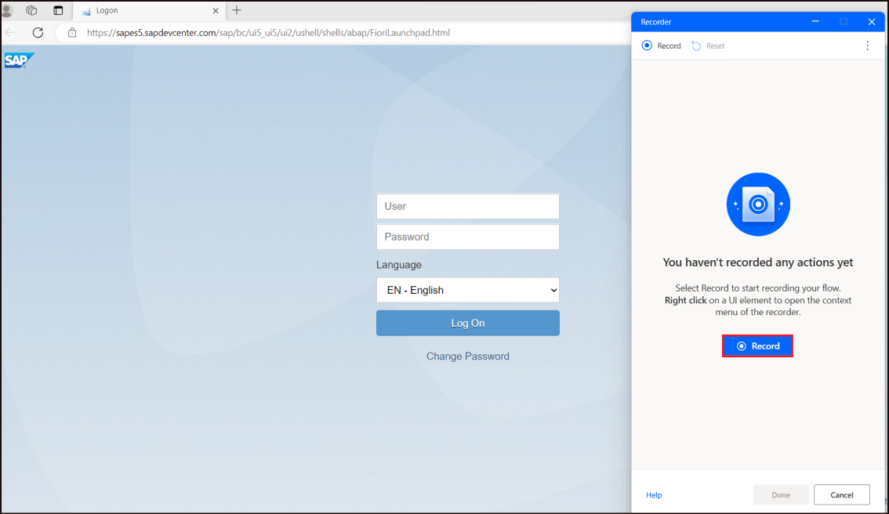

9. Select the **User ID field** and enter the SAP User ID into that,
then press **Tab** button and enter SAP Password. In last click on the
**Log On** button.

> **Note:** While logging in, ensure that the text field or the
button that you are clicking on is highlighted, to ensure that your
action is being recorded by the recorder. (Like the Logon button is
highlighted in the screenshot below).

9.  After recording, click on **Pause** button place at top and look for
    the recorded value in the recorder. Click on **Arrow** next to Text and
    select **Variable**.

    

10. Once Variable is selected, click on **{X}** select **SAPUserID** from the
    variable names.

    

11. Click on **Direct encrypted text input** down arrow and select
    Variable. Then select {X} and change the variable name as
    **SAPPassword**.

    

12. In the Recorder window, the recorded events should look like the
    events in the screenshot below. After confirming click on **Done**.

    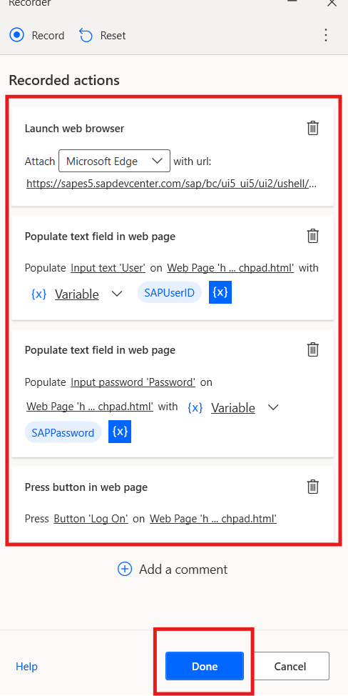

13. The subflow SAP_Logon should look like the one in the screenshot
    below. From top click on the **Save** button.

    

    

14. Log out SAP, close the Edge browser. Go to Power automate flow right
    click **Run from here** on the Launch new Microsoft Edge action from
    the Power Automate SAP_Logon sub flow to check if the flow is
    working fine.

    

15. The flow would open a new edge browser, type in the User and
    Password details, click on the **Logon** button and opens the SAP Fiori.

    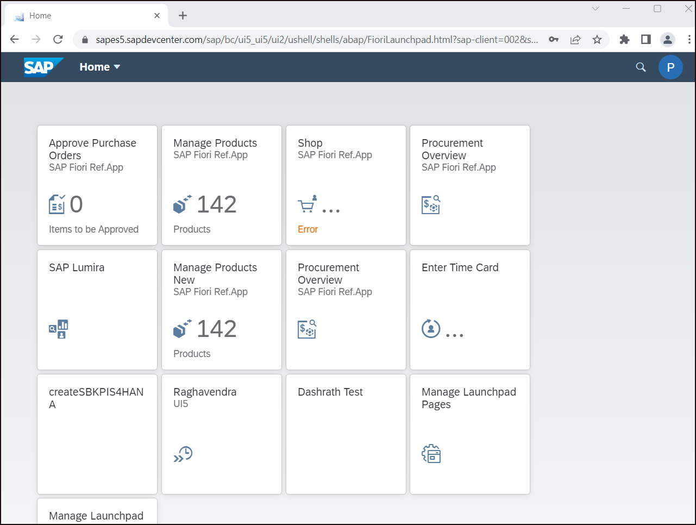

16. Back in the Power Automate Desktop flow, click on the UI Elements
    icon from the right pane and select **Add UI element.**

    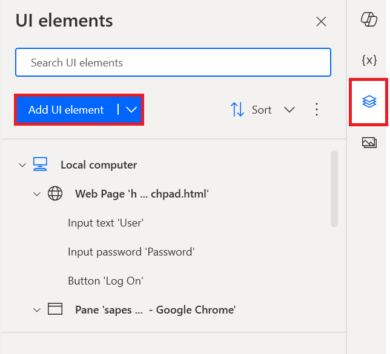

17. Open the edge browser with the SAP Fiori open and capture the UI
element Purchase EPM. To do this hover over the Purchase EPM. Once you
get it surrounded by the red box, press **Ctrl button and perform a left
click**.

    

17. This will add an entry in the UI element pane from bottom of the UI
    window click on **Done**.

    

18. Back in the Power Automate screen, right click on the added UI
element and select **Rename**. Rename it as +++Heading+++.  

    

    

18. Add an action, +++wait for web page content+++ as the last step in
    the SAP_Logon subflow. Select **Heading** under the UI element option
    and click on **Save**.

    

19. Click on **Save** icon to save the flow. Now, we have a flow which
    will open the SAP Fiori in a new edge browser, will logon to the
    system and wait till the page is loaded.

    

20. Close the browser that is opened while testing and then check the
    flow by performing a right click on the first action and select Run
    from here.

# Exercise 4: Add and configure subflow SearchProductBySupplier

## Task 1: Add Sub Workflow

1.  From the Power Automate flow page, click on the **Subflows** --> **+ New
    subflow**.

    

2.  Type in the name of the subflow as +++SearchProductBySupplier+++ and
    click on **Save**.

    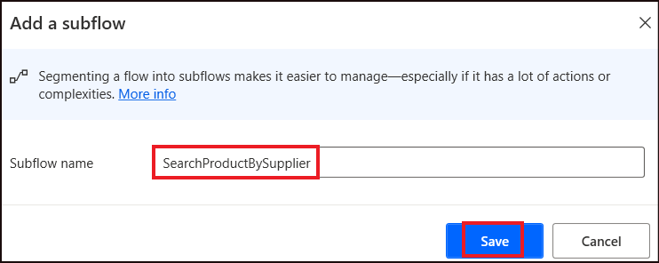

## Task 2: Capture UI Elements for Search by supplier

1.  Click on the **UI element** and select **Add** **UI** **element**.

    

2.  Now, we will open the browser in which the SAP Fiori is open and
    capture the UI elements that will be used in this flow. To capture
    the UI elements, select CTRL+left click together.

    First, capture the **Manage** **Products** (Ctrl+left click) option in the SAP
    Fiori page. Once the element has been added to the UI element picker,
    click on the **Manage** **Products** option from the web page again (this time
    we are clicking on it to navigate to the next page and then capture
    the other elements from there).

    

> Note: For each of the element, we will first capture the UI element
and then click on the same from the browser to get the flow of the
execution.

3.  Capture the **Supplier** **ID** (Ctrl+left click) option, Once the element
    has been added to the UI element picker, click on the **Supplier** **ID**
    option from the web page again.

    

4.  Capture the **Search** **box** (Ctrl+left click) option, Once the element
    has been added to the UI element picker, type in the +++AVANTEL+++
    in the Search bar.

    

5.  Capture the **Search** **icon** (Ctrl+left click) option, Once the element
    has been added to the UI element picker, click on the **Search** **Icon**
    option from the web page again.

    

6.  Capture the **Check** **Box** (Ctrl+left click) option, Once the element has
    been added to the UI element picker, click on the **Check** **box** option
    from the web page again.

    

7.  Capture the **Select** (Ctrl+left click) option, Once the element has
    been added to the UI element picker, click on the **Select** option from
    the web page again.

    

8.  Capture the **Go** (Ctrl+left click) option, Once the element has been
    added to the UI element picker, click on the **Go** option from the web
    page again.

    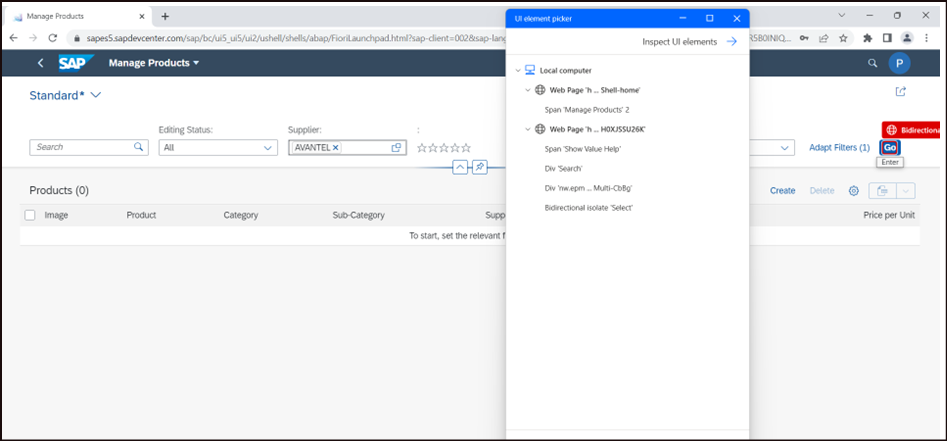

9.  The UI element picker should now have all these UI elements added.
    It should now look like the one in the screenshot below. Click on
    **Done** on the UI element picker.

    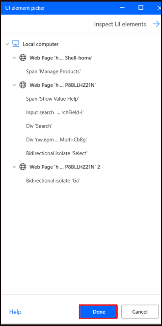

10. Then, right click on each of the element and rename it for easier
    understanding. The elements will look like below after renaming.

    - +++Manage Products +++

    - +++SupplierID+++

    - +++SearchBox+++

    - +++Search icon+++

    - +++Checkbox+++

    - +++Select+++

    

## Task 3: Add actions to the flow

1.  Now, we will add the elements that were captured in the Task 2
    above, to the **SearchProductBySupplier** **subflow**.

2.  Add an action, +++Click link on web page+++ and select **Manage**
    **Products** UI element. Leave the other defaults. Click on **Save**.

    

3.  Add an action, +++Click link on web page+++ and select **Supplier** **ID**
    UI element. Click on **Save**.

    

4.  Add an action, +++Click link on web page+++ and select **Search** **Box** UI
    element. Click on **Save**.

    

5.  Add an action, +++Populate text field on web page+++ and again
    select **Search** **Box** UI element. Under Text, type the Value to be
    searched for. Here we have used +++AVANTEL+++. This can be changed
    as per your preference. Click on **Save**.  

    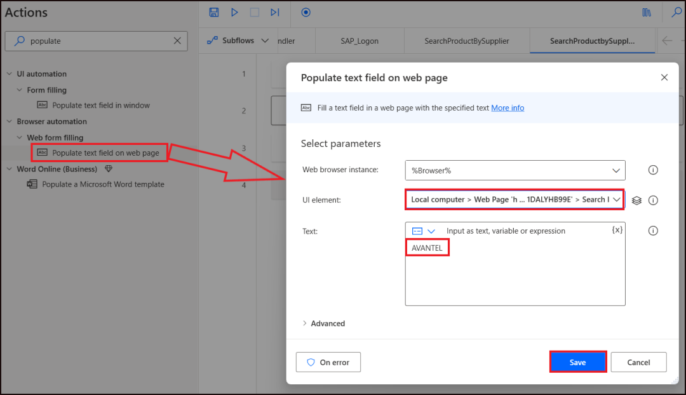

    > Note: Instead of hard coding this value, we can also add an input
    variable and then use the variable name here.

6.  Add an action, +++Click link on web page+++ and select **Search** icon
    UI element. Click on **Save**.

    

7.  Add a **Wait** Action. Enter the duration as +++2+++ to wait for 2
    seconds for the product to get loaded based on the Search text.
    Click on **Save**.  

    

8.  Add an action, +++Send Keys+++. Select **Tab** key from Insert Special
    Keys - **Misc** --> **Tab**. Click on Save.  

    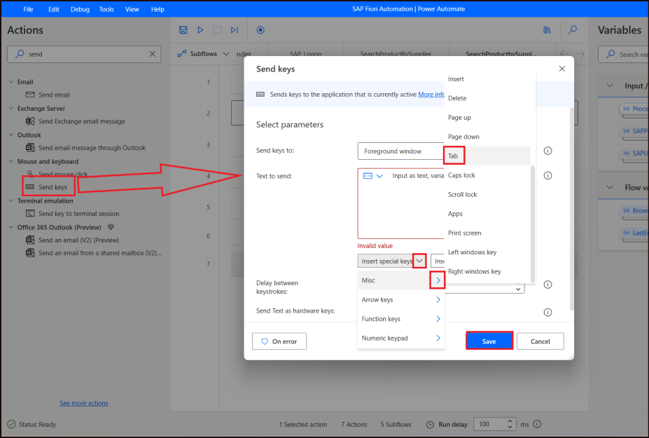

9.  Add another +++Send Keys+++ Action and select **Space** instead of Tab.
    Click on Save.  

    

10. Add an action, +++Click link on web page+++ and select **Select** UI
    element.  

    

11. Add an action, +++Click link on web page+++ and select **Go** Button UI
    element.  

    

12. The flow should now look as in the screenshot below.  

    

13. Add an action, +++Extract data from web page+++ . Once added, with
    the Extract data from web page open in the Power Automate flow, open
    the browser in which we have the selected list of products on the
    SAP Fiori.

14. Right click on the column name (**Image**) and select **Extract** **entire**
    **HTML** **table**.  

    

15. Once the table is added, click on **Finish** in the Extraction preview
    pane.  

    

16. Back in the Power Automate, in the Extract data from web page pane
    select Store data mode as Excel spreadsheet and click on **Save**.  

    

17. Click on **Save** icon to save the flow. Now, we have a sub flow which
    will search for a specific supplier name and export all the products
    of the supplier into an Excel.

# Exercise 5: Add subflow SAP_Logoff

## Task 1: Create Sub flow SAP_Logoff

1.  Click on Subflows - **+ New subflow**.

    

2.  In the +++Add a subflow+++ pane, enter the name of the subflow as
    +++SAP_Logoff+++ Click on **Save**.  

    

3.  The created subflow gets opened in a new tab. Open the UI Element
    pane and click on **Add UI element**.

    

4.  Capture the UI elements to perform the Log off action from the
    browser. Capture the P – Profile button from the top right corner of
    the browser. To capture, press **Ctrl+Left** click on the item to be
    captured. Once captured, an entry will be made in the UI Element
    picker.

    

5.  Click on **Done** in the UI element picker.

    

## Task 2: Rename UI Elements

1.  Click on the added UI element one by one and change the name for
    each of them. Select the **Profile** Button UI Element that we captured
    and change its name to +++Profile Button+++.

    

2.  After renaming, the list of the log off actions UI elements should
    be like the list in the screenshot below.

    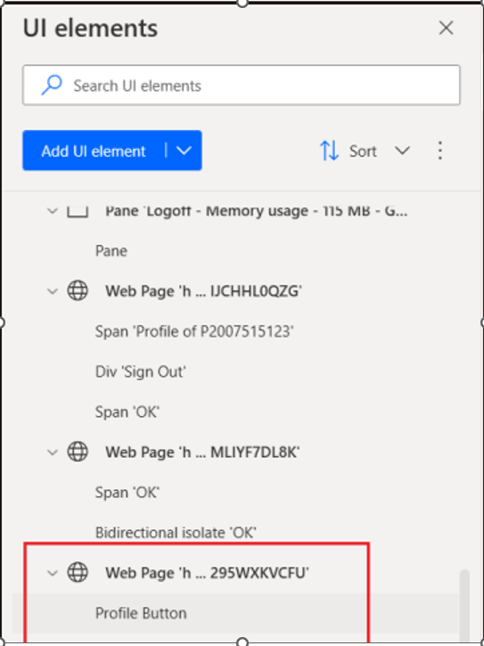

## Task 3: Add Actions to the subflow

1.  From the Actions pane, Search and select +++Click link on web
    page+++ action to the SAP_Logoff subflow pane. Select the **UI Element**
    to be the **Profile** Button. Click on **Save**.

    

2.  Next, add an action, +++Send Keys+++. Enter the given below text in
    Text to send field and then click on the **save** button  
    +++{Down}{Down}{Down}{Down}{Down}{Down}{Return}{Space}+++  

    

3.  Add an action, +++Close web browser+++ and click on **Save** with the
    web browser instance value as Browser.  

    

4.  Now, the subflow should look like this.  

    

**Exercise 6: Configure the Main flow**

1.  The main flow does not have anything in it now. We will arrange the
    subflows that we created in order in the main flow to get a complete
    execution. First in the Main flow, from the Actions pane, drag and
    drop add an action +++On block error+++ into the Main flow tab.

    

3.  Name the error block as +++MainExceptionBlock+++ . Click on + **New**
    **rule** - **Run** **subflow**.

    

4.  In the Run subflow option that gets added, select **ExceptionHandler**.
    Click on Save.

    

5.  The Main flow will now look like this.  

    

6.  Next, add an action +++Run subflow+++ . Select **SAP_Logon** subflow
    from the drop down and click on Save.  

    

    

7.  Similarly, add the 2 more actions of Run subflow and select
   **SearchProductBySupplier** and **SAP_Logoff** in the same order.

8.  Your main flow should now look like this.  

    

9.  Click on **Save**.  

    

**Exercise 7: Test the Flow**

1.  From the Main block, right-click on the **On block error** and select Run from here.  

    

2.  Observe the flow that does the following.

    1. Opens the SAP Fiori URL in a new Edge browser.
    2. Logs into the system, providing the username and password.
    3. Clicks on the Manage Products page.
    4. Search for a specific supplier and get the list of the supplier's products.
    5. Exports the data to an Excel sheet.
    6. Logs off from the system.
    7. Closes the browser.

**Conclusion**

In this lab, participants have successfully learned how to automate SAP
Fiori tasks using Power Automate Desktop. They explored key concepts
such as installing the Power Automate Desktop environment, creating
flows, and managing variables. Additionally, they developed error
handling with subflows, automated the SAP Fiori login process, and
captured web UI elements to automate actions like searching for products
by supplier. This exercise enhances participants' automation skills and
introduces them to streamlining SAP Fiori processes efficiently through
Power Automate Desktop flows.

