# Lab 5 - Automating Product Info and Pricing Updates in SAP Using Microsoft Copilot Studio

## Objective

Develop a lab use case for Contoso Electronics to streamline product
information retrieval and price updates in SAP using Microsoft Copilot
Studio integrated with Power Automate. The solution should help
Contoso’s operations team to efficiently query product data, update
prices, and test these updates in SAP, enabling faster decision-making
and operational improvements.

## Solution Focus Area

Contoso Electronics is continuously updating its product catalogue and
prices based on market trends and promotions. However, the manual
process of querying product information and updating prices in SAP
systems is time-consuming and prone to human error. The goal is to
automate the process by integrating Microsoft Copilot Studio with SAP
via Power Automate, allowing Contoso’s team to retrieve product data and
update prices quickly and accurately.

**Key Challenges:**

- **Product Information Retrieval:** Contoso’s operations team often
  requires real-time product information to make data-driven decisions.
  However, querying product information from SAP involves manual steps,
  leading to delays.

- **Price Updates:** Keeping product prices up to date in SAP based on
  promotions or market changes is critical but is currently slow and
  inefficient, affecting pricing accuracy.

To address these challenges, Contoso will use Microsoft Copilot Studio
integrated with Power Automate to automate SAP queries and updates,
ensuring accuracy and efficiency in operations.

### Estimated Time : 45 min

## Exercise 1: Create and Configure Copilot

### Task 1: Login in Copilot studio

1.  Navigate to
    +++https://www.microsoft.com/en-us/microsoft-copilot/microsoft-copilot-studio+++
    and click on **Sign in** button.

- 

2.  Enter the login **Admin tenant login ID** and click on the Next.

- 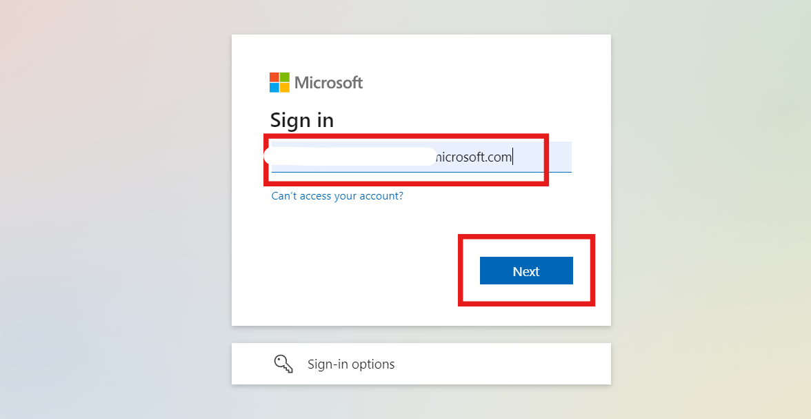

3.  Enter the **Admin tenant Password** and click on the **Sign In**
    button.

- 

4.  Select **yes** for stayed sign in with credential.

- 

### Task 2: Create a Copilot with Gen AI Capabilities

1.  Open Copilot studio and from top environment sections select **Dev
    One** environment.

- 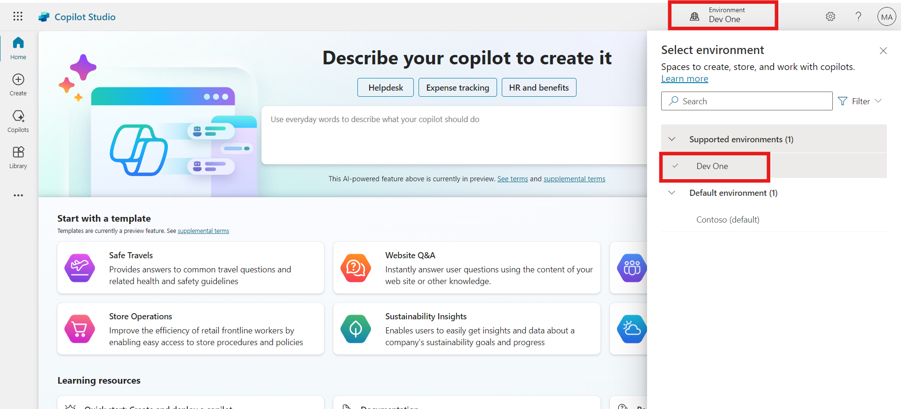

2.  Click on the **Create** button form the left navigation bar and then
    select **+ New Agent** option.

- 

3.  Click on the **Skip to configure** and start manual configuration of
    copilot.

- 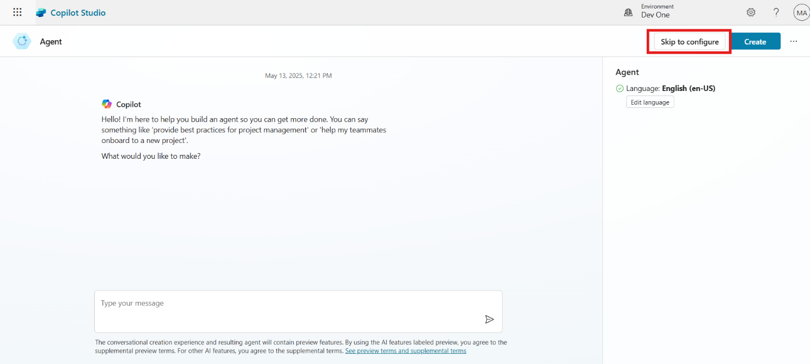

4.  Enter the following details in the respected fields and click on the
    **Create** button.

    1.  **Name:** +++SAP Product Copilot+++

    2.  **Description:** +++The Copilot allows you to integrate SAP
        system and fetch product information live from SAP and update
        price of products.+++

    3.  **Instructions:** +++The copilot must check the available
        product in SAP system and provide the product information as per
        the requirement and update the price of the product.+++

- 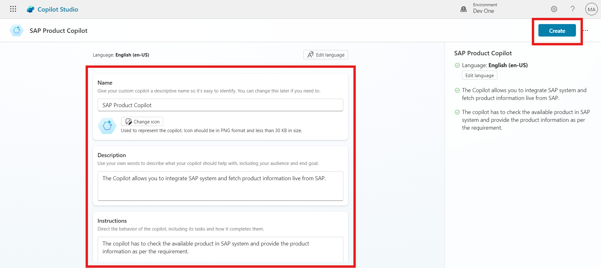

5.  Click on the **Setting** form the top right corner and then select
    **Generative AI** option. In Generative AI setting select
    **Generative AI (Preview)** and select **Medium** content
    moderation. After the configuration click on the **Save** button.

- 

## Exercise 2: Create Power Automate Flow for SAP Integration

### Task 1: Create Power Automate Flow for Product Information

1.  Then go back to overview section of copilot and select **Actions**
    from the top bar. After click on actions select **Add an action**
    button to create a new SAP action.

- 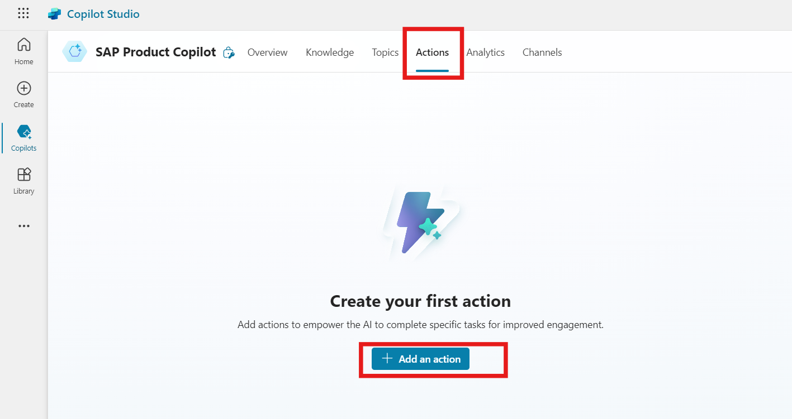

2.  Click on the **+ New action** and then select **New Power automate
    flow.**

- 

3.  From top left corner rename the flow as +++**SAP Product
    Category**+++.

- 

4.  Click on the **When an agent calls the flow** and select **+ Add an
    input**.

- 

5.  In **+ Add an input** option select **Text** as type of input.

- 

6.  Enter +++**Product Input**+++ in the input section.

- 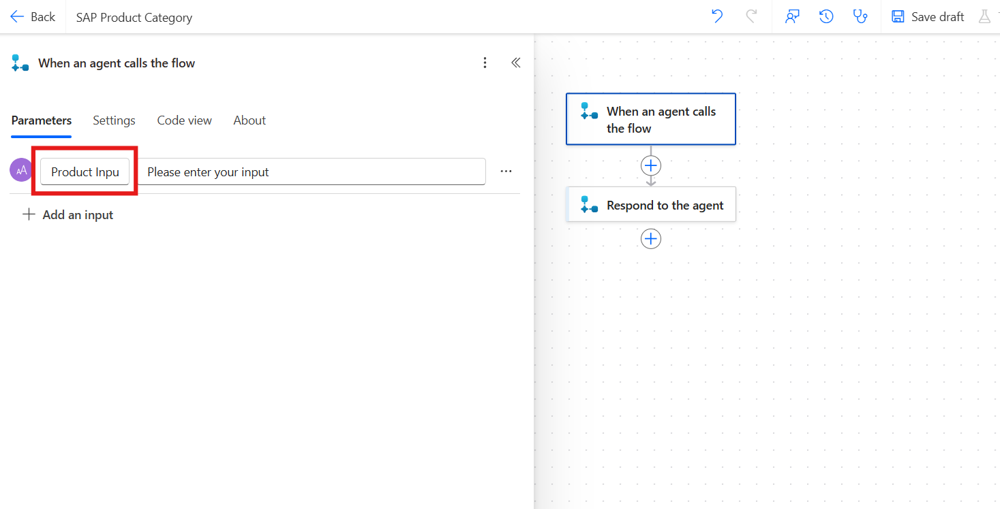

7.  Click on the **+** sign, search for the **SAP OData** and select
    **Query OData entities.**

- 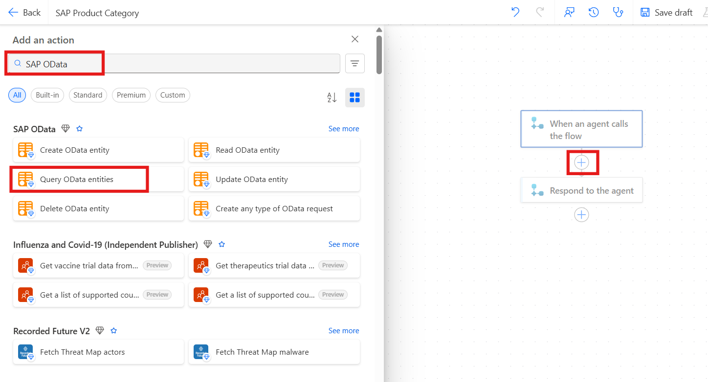

8.  Enter the following Details in the Create a new connection section
    and then click on the **Create new button**.

    1.  **Connection Name:** +++SAP-Product-100+++

    2.  **Authentication Type:** Basic

    3.  **OData Base URL:**
        +++https://sapes5.sapdevcenter.com/sap/opu/odata/iwbep/GWSAMPLE_BASIC+++

    4.  **User Name:** Enter the ES5 SAP User ID which we created in Lab
        1.

    5.  **Password:** Enter the ES5 SAP Password which we created in Lab
        1.

- 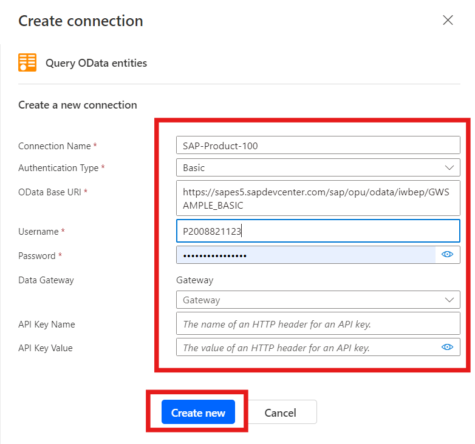

9.  In **OData Entity Name** select **Productset** and then click on
    **Show all.**

- 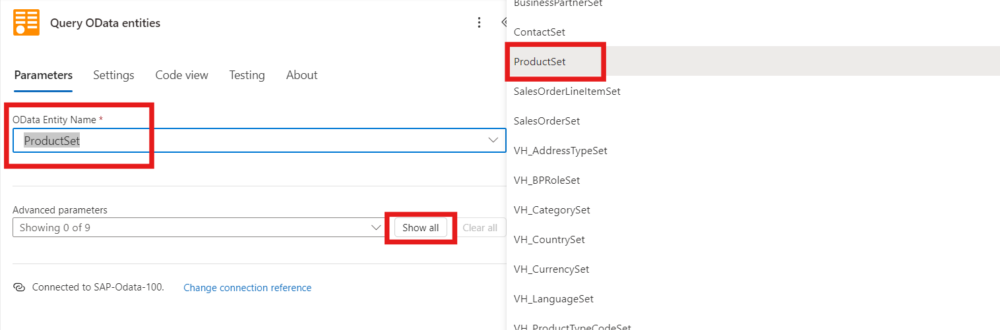

10. In **$Top** section enter **10**, which will return top 10 product.

- 

11. Click on the **Respond to the agent** option and click on **Add an
    output** option.

- 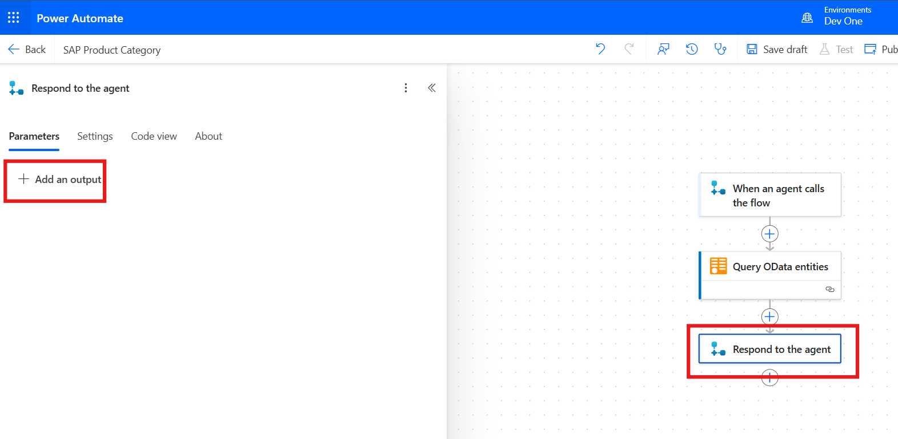

12. Select **Text** as type of output.

- 

13. Enter +++**Product Output**+++ as the output name and then enter the
    +++string(body('Query_OData_entities'))+++ as the expression value
    of the output with the help of a function. Click on the Add button
    after entering the output query.

- 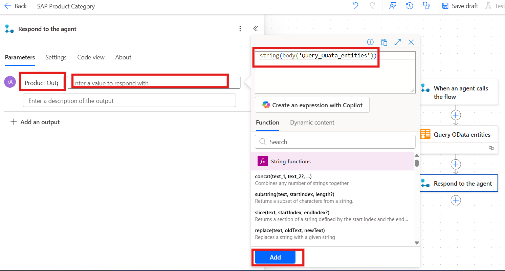

14. **Save** and **Publish** the Power automate flow.

- 

15. Go back to copilot studio and click on the **Refresh**.

- 

### Task 2: Create Power Automate Flow for Update Product

1.  On the **Add an action** window, click on the + New action and
    select **New Power Automate flow.**

- 

2.  Rename the Flow Name as +++**Update Product Price**+++

- 

3.  Click on the **When an agent calls the flows** and then select **+
    Add an input.**

- 

4.  Select the type of user input as **Text**.

- 

5.  Rename the input name as +++**Product ID**+++ .

- 

6.  Then again click on the **+ Add an input**, select **Number** as
    input type and rename the input as +++**Update Price**+++ .

- 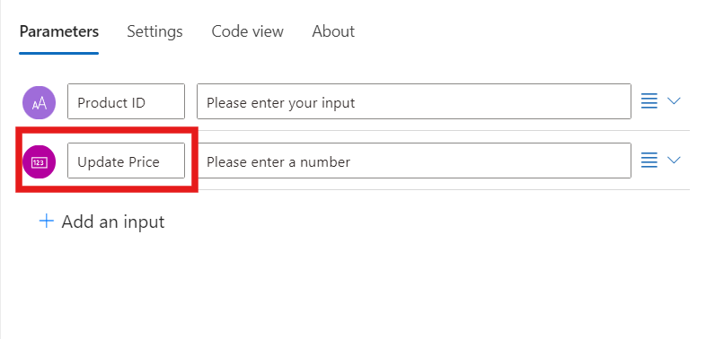

7.  Click on the + Icon, Search for the **SAP OData** and select
    **Update OData entity**.

- 

8.  Click on the OData Entity Name and select **ProductSet.**

- 

9.  In the ProductID sections select **ProductID** with the help of
    dynamic content.

- 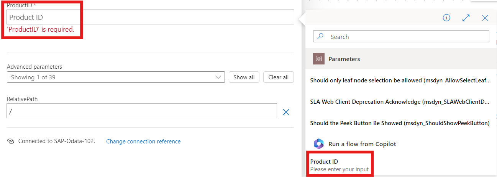

10. Click on the **Advanced parameters** and select **Price**.

- 

11. In the price parameter enter **Update Price** with the help of
    dynamic content.

- 

12. Click on the **Save draft** and then click on **Publish**.

- 

## Exercise 3: Integrate Power Automate Flow with Copilot

### Task 1: Integrate SAP Product Category Flow

1.  Go back to copilot studio window and click on the **Refresh**
    button.

- 

2.  On add an action window, click on the ellipsis icon (…) and select
    **Flow**

> 

3.  select **SAP Product Category** flow.

- 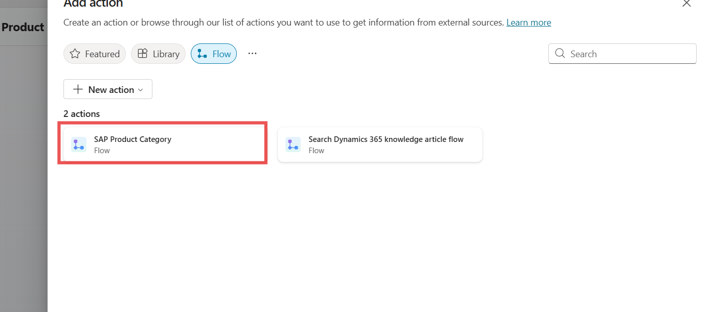

4.  Click on the **Input and outputs** and select Product Input.

> 

5.  Click on the **Description** field and enter below given description
    in the field then click on the **Done** button.

  **Description:** Product Category. One of the following
  categories can be used. The name has to be exactly like this:
  Accessories, Notebooks, Laser Printers, Mice, Keyboards, Mousepads,
  Scanners, Speakers, Headsets, Software, PCs, Smartphones, Tablets,
  Servers, Projectors, MP3 Players, Camcorders.

  

6.  On the Output section, click on the **+ Add** and select **Product
    Output**

- 

7.  Click on the Product Output and Enter the following
    Description and then click on the **Done** button.

  **Description:** List of SAP products for a provided product
  category. Return the result as a table including the following
  information: ProductID, Category, Name, Description and Price.

  

8.  Click on the **Add action** button.

> 

- 

9.  Click on the **Test** Button place as the top right side and enter
    the prompt +++Notebooks+++ in the respected field. It will return
    the connect request. Click on the **Connect** to give permission.
    After select connect, it will redirect to connection window.

- 

10. In the Manage your connections window click on the **Connect**
    button.

- 

11. Click on the three dots on SAP OData and select **SAP-Product-100**
    connection. After selecting the connection click on the **Submit**
    button.

- 

12. Flow is shown as connected in the Manage connections.

- 

### Task 2: Create topic Product Update

1.  Go to topic for the top bar and click on the **Add new topic** and
    then click on **From** **blank**.

- 

2.  Rename the topic as +++**Product Update**+++.

- 

3.  In the trigger node, Enter the below given description.

- +++Update Product, Update Product Price, Update Price, Price Update+++

  

4.  Below trigger node, add **Send a** **Message Node.**

- 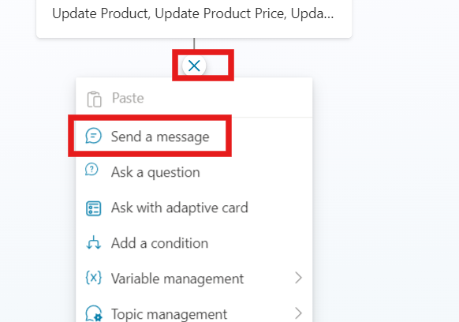

5.  Enter the message in the Message Node which is given below.

- +++Thank you for using our service. Please enter **Product ID** and
  **Update Price** in below given card.+++

  

6.  Click on the + Sign below message node and add **Ask with adaptive**
    **card** node.

- 

7.  Click on the Ellipsis icon (...) on the adaptive card and click on the
    **Properties**.

- 

8.  Click on the Edit adaptive card, Enter the below give code and then
    click on the Save and then Close button from top.

```

      {
      "type": "AdaptiveCard",

      "$schema": "http://adaptivecards.io/schemas/adaptive-card.json",

      "version": "1.3",

      "body":[

          {
              "type": "Input.Text",

              "placeholder": "Placeholder text",

              "id": "1",

              "label": "Product ID"

              },

              {

                  "type": "Input.Number",

                  "placeholder": "Placeholder text",

                  "id": "2",

                  "label": "Updated Price"

                  },

                  {
                      "type": "ActionSet",

                      "actions":

                      [

                          {

                              "type": "Action.Submit",

                              "title": "Submit"

                              }
                              ]
                              }
                              ]
                              }

  ```

  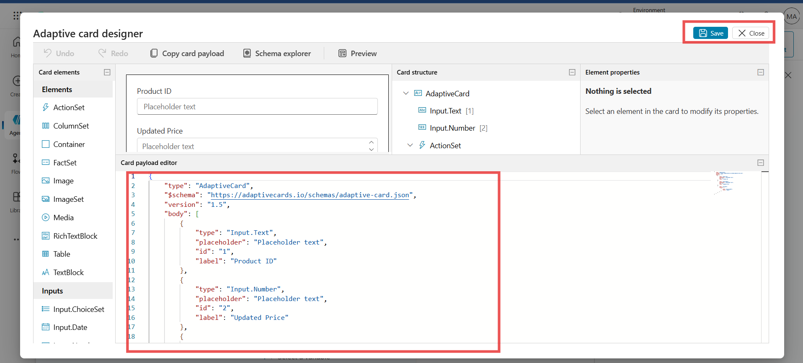

9.  The below adaptive card output section is available in the output **section
    1** Variable click on select a variable, and then click on the create
    new, a new variable **Var1** is created.

- 

10. Repeat the same process for the next output **Var2** is created.

- 

11. Go to variable from the top and select all right-side check box for
    all variables.

    **Note**: If the variable option is not visible, click on the ellipsis icon Next to Save button and then select **Variable**

- 

12. Below adaptive card, click on + sign and select **Add an action**,
    then select **Update Product** **Price** flow.

- 

13. In the Action select **Var1** for Product ID and **Var2** for Update
    Price.

- 

  

14. Below Action node, click on + sign and add **Message node**, in
    message node enter the flowing message. +++**Product Var1 price is
    updated. Thankyou.**+++ Replace **Var1** with Variable **Var1** with
    the help of {x} button.

- 

15. From top right corner, click on the **Save** button.

- 

16. Click on the **Test** button and enter the prompt +++Update
    Price+++. Then fill in the Product ID +++HT-1001+++ and price
    +++1540+++, click on **Submit**. After clicking on submit a message
    show to connect. Click on the **Connect**.

- 

17. It will navigate to another window which manages the connections.
    Click on the **connect** button of Update Product Price.

- 

18. Click on the three dots and select connection SAP-Product-100 then
    click on **submit** button.

- 

19. After completing it shows connected.

- 

20. Go back to copilot window and Click on the **publish** button to
    save the copilot setting

- 

## Exercise 4: Test Copilot 

1.  Click on the **Test** button from top and then select **Refresh**

> 

2.  Enter prompt, +++**Give me information about Notebooks+++**


- 

3.  It returns the information of the Notebooks from SAP System.

- 

4.  Then give another prompt, +++**Update price of product.**+++

- 

5.  Now it returns the adaptive card, enter Product ID +++HT-1001+++ and
    in price enter +++1111+++ and then click on the **submit**.

- 

6.  After entering the Product ID and Price confirmation message
    appears.

- 

7.  To confirm the updation, go to
    +++https://sapes5.sapdevcenter.com/+++ , click on Fiori Launch,
    **login** with your SAP User Id and Password, Click on **Manage
    product**. Then in search bar type +++HT-1001+++ and then click go.

- 

8.  Now see the updated price of the product is 1111.

- 

### Conclusion

In this lab, participants learned how to create an SAP account and set
up a Gateway Demo System for accessing SAP. They were guided through
configuring Microsoft Copilot Studio with generative AI capabilities to
integrate SAP and automate product information retrieval and updates.
Using Power Automate, participants created flows to fetch and update
product data in SAP. The exercises highlighted key skills in connecting
SAP with Microsoft technologies for streamlined business processes.
